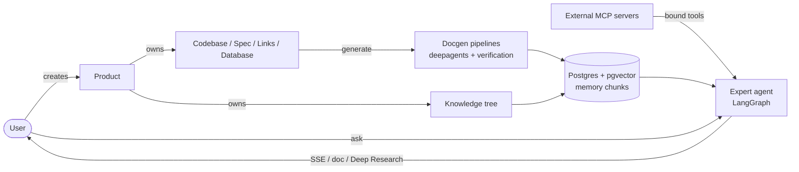
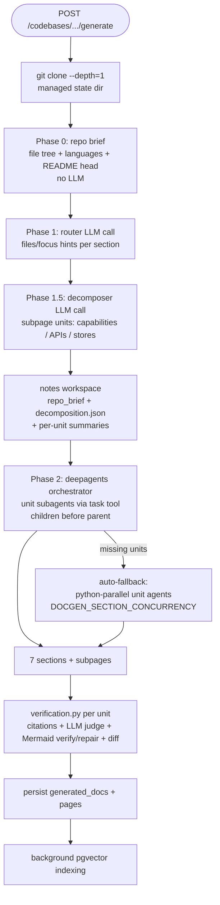
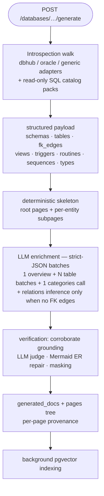

# Productarium

> A product-centric technical documentation platform with fully local LLMs: no cloud API keys required.

Productarium turns repositories, OpenAPI/AsyncAPI specs, links, databases, and knowledge pages into coherent, indexed, verifiable documentation. Each **Product** (a microservice, a monolith, a data-bus service) owns typed **entities** — a **Codebase**, a **Spec**, **Links**, a **Database** — plus a tree of **Knowledge Nodes**. The agent stack is built on **LangChain / LangGraph**: a **deepagents** pipeline generates codebase docs with citation checks and an LLM judge, a **Deep Research** flow answers multi-iteration research questions, and databases are **reverse-engineered through MCP introspection tools**. Semantic memory runs directly on **PostgreSQL + pgvector** (cosine recall, HNSW index). An **MCP platform** works in both directions: external MCP servers' tools are bound to products and appended to the expert agent, and Productarium itself is exposed as an MCP server.

[English](./README.md) | [Русский](./README.ru.md)

---

## Table of Contents

1. [Architecture Overview](#1-architecture-overview)
2. [Requirements & Dependencies](#2-requirements--dependencies)
3. [Quick Start](#3-quick-start)
4. [Two-Process Architecture](#4-two-process-architecture)
5. [Product-Centric Data Model](#5-product-centric-data-model)
6. [Backend Modules (api/)](#6-backend-modules-api)
7. [Routers (api/routers/)](#7-routers-apirouters)
8. [Authentication (api/auth/)](#8-authentication-apiauth)
9. [Integrations (api/integrations/)](#9-integrations-apiintegrations)
10. [MCP Platform (api/mcp/)](#10-mcp-platform-apimcp)
11. [Configuration (api/config/)](#11-configuration-apiconfig)
12. [Prompts (refs/prompts/)](#12-prompts-refsprompts)
13. [Documentation Generation Pipeline](#13-documentation-generation-pipeline)
14. [Database Reverse-Engineering](#14-database-reverse-engineering)
15. [Memory & Recall (pgvector)](#15-memory--recall-pgvector)
16. [Expert Agent](#16-expert-agent)
17. [Frontend (src/)](#17-frontend-src)
18. [Docker & Deployment](#18-docker--deployment)
19. [Environment Variables](#19-environment-variables)
20. [Testing](#20-testing)
21. [Key Patterns](#21-key-patterns)
22. [Troubleshooting](#22-troubleshooting)
23. [License & Third-Party Components](#23-license--third-party-components)

---

## 1. Architecture Overview

Productarium is a fully local, product-oriented documentation platform. The agent stack is **LangChain + LangGraph** (single OpenAI-compatible LLM path via `langchain-openai`), semantic memory is **pgvector-direct** (no external knowledge-graph service), documentation generation runs on **deepagents** with a verification pipeline (citations, LLM judge, Mermaid checks), and the **MCP platform** (via `langchain-mcp-adapters` + `mcp`) connects external tools both ways.

Data flow: **Product → Entity → Documentation**.

- The user creates a **Product** (`POST /api/products`) and adds a **Codebase** / **Spec** / **Links** / **Database** entity.
- Generation (`POST /api/products/{id}/codebases/{cid}/generate` etc.):
  - **codebase**: the backend clones the repository (shallow, `--depth=1`) into the managed state dir, then a **deepagents** agent explores the clone with read-only, path-confined tools (`repo_list_files`, `repo_read_file`, `repo_grep`) and writes 7 wiki sections — Functional / Technical / Data Model are parent pages decomposed into per-capability, per-API and per-store SUBPAGES by a planning LLM call. Units share a notes workspace (`repo_brief.md`, per-unit summaries) to reuse context instead of re-reading the same files. The **verification pipeline** runs per unit: citations, LLM judge, Mermaid verify/repair, provenance fingerprints. `generated_docs` + `pages` are persisted; text is indexed into pgvector in the background.
  - **spec**: the spec is parsed (stdlib json/yaml) into a Markdown skeleton + LLM enrichment (a LangGraph flow), then verified and indexed.
  - **database**: reverse-engineered via MCP introspection tools (see [§14](#14-database-reverse-engineering)).
  - **links**: storage only, no generation.
- The frontend renders `entity.pages` (nav tree) + Markdown/Mermaid; the Ask panel and the expert agent recall from the product's pgvector chunks (cosine, top-k) with artifact-docs fallbacks.
- The **Expert agent** (`POST /api/products/{id}/ask`) streams an SSE chat over the product's indexed knowledge with persistent per-user sessions (LangGraph checkpointer); `POST /api/products/{id}/ask/doc` generates a self-contained Markdown document; **Deep Research** runs a bounded multi-iteration research loop.



---

## 2. Requirements & Dependencies

### Prerequisites
- **Python 3.11+**
- **Node.js** with **bun** (the frontend uses bun, not yarn)
- **An OpenAI-compatible server** running locally (LM Studio, llama.cpp, vLLM) with a generation model and an embedding model (e.g. `qwen/qwen3.6-27b` + `text-embedding-nomic-embed-text-v1.5`).
- **PostgreSQL + pgvector** for products/entities, chat sessions, agent checkpoints, and semantic memory. `docker-compose up postgres` starts `pgvector/pgvector:pg18-trixie` (user/db: `cognee`/`cognee_db`). If Postgres is unreachable, `init_db()` logs a warning and the app falls back to SQLite (degraded: no cosine recall).

### Backend (Python FastAPI) — api/pyproject.toml
| Package | Purpose |
|---------|---------|
| `fastapi`, `uvicorn` | Web framework and ASGI server |
| `pydantic` | Request/response validation schemas |
| `langchain`, `langchain-openai`, `langchain-text-splitters` | LLM client stack (single OpenAI-compatible path) |
| `langgraph` | Agent orchestration (expert agent, deep research, spec docgen) |
| `langgraph-checkpoint-postgres` / `langgraph-checkpoint-sqlite` | Persistent expert-agent sessions |
| `deepagents` | Agentic codebase docgen (planning + repo tools) |
| `langchain-mcp-adapters`, `mcp` | MCP platform (outbound tool manager + inbound FastMCP server) |
| `sqlalchemy` (≥2.0) | ORM, persistence |
| `psycopg` (LGPL, binary extra) | PostgreSQL driver |
| `pgvector` | Direct pgvector memory backend (cosine recall, HNSW) |
| `openai`, `tiktoken` | OpenAI-compatible SDK + token counting |
| `authlib` | OIDC (Keycloak) |
| `passlib[bcrypt]`, `pyjwt` | Local auth (passwords + session JWTs) |
| `cryptography` | Fernet encryption of settings-store secrets |
| `python-multipart`, `markitdown` | File uploads converted to Markdown |
| `websockets` | WebSocket chat |
| `jinja2`, `pyyaml` | Prompt templates, YAML spec parsing |

### Frontend — package.json
`next` (15), `react` (19), `mermaid`, `next-intl`, `next-themes`, `@phosphor-icons/react`, `geist`, `react-markdown`, `react-syntax-highlighter`, `rehype-raw`, `remark-gfm`, `svg-pan-zoom`. Built with **bun**.

---

## 3. Quick Start

### Run with Docker Compose
```bash
cp .env.example .env
docker-compose up
```
This starts **postgres** (pgvector) and **productarium** (FastAPI on `:8001`, Next.js on `:3000`). Open [http://localhost:3000](http://localhost:3000). On first run, the UI walks you through creating the first admin user (`AUTH_PROVIDER=local`). An OpenAI-compatible server is expected to run on the host; the compose file maps `host.docker.internal` to the host gateway.

### Backend (development)
```bash
python -m pip install poetry==2.0.1 && poetry install -C api
python -m api.main              # uvicorn on port 8001 (hot-reload in dev)
```

### Frontend
```bash
bun install
bun run dev        # port 3000, turbopack
bun run build      # production build
bun run lint       # ESLint (next/core-web-vitals + next/typescript)
```

### Postgres only
```bash
docker-compose up postgres
```

---

## 4. Two-Process Architecture

- **Frontend**: Next.js on port 3000. Proxies API calls to the backend via rewrites in `next.config.ts`.
- **Backend**: FastAPI on port 8001 (`api/api.py` is the main app, started via `api/main.py`).
- Communication: REST (SSE streaming) + WebSocket.

```
┌─────────────────┐     ┌─────────────────┐     ┌─────────────────┐
│   Frontend      │     │   Backend       │     │   OpenAI-compat │
│   (Next.js 15)  │◄───►│   (FastAPI)     │◄───►│   Local LLM +   │
│   Port: 3000    │     │   Port: 8001    │     │   embeddings    │
└─────────────────┘     └────────┬────────┘     └─────────────────┘
                                 │
                        ┌────────▼────────┐      ┌─────────────────┐
                        │   Postgres +    │◄────►│  External MCP   │
                        │   pgvector      │      │  servers (tool  │
                        │  (data+memory)  │      │  bindings)      │
                        └─────────────────┘      └─────────────────┘
```

Proxy pattern: the frontend does NOT call the backend directly from the browser for most endpoints. `next.config.ts` defines rewrites that proxy `/api/*` to `SERVER_BASE_URL` (default `http://localhost:8001`). WebSocket connections go directly to the backend.

---

## 5. Product-Centric Data Model

SQLAlchemy 2.0 ORM models in `api/models.py`. String PKs (`prod_…`/`cb_…`/`user_…`/`node_…`/`tok_…`) keep frontend compatibility.

No polymorphic artifact entity — separate typed ORM models per entity kind:

- **ProductORM** (`products`): `id, name, summary, owner_id, created_at, updated_at`. Owns `codebases`, `specs`, `links`, `databases` relationships (`cascade="all, delete-orphan"`).
- **CodebaseORM** (`codebases`): `id, product_id (FK CASCADE), name, repo_url, repo_type, token, generated_docs (Text), pages (JSON tree), verified/verified_by/verified_at, source, timestamps`.
- **SpecORM** (`specs`): `id, product_id, name, kind (openapi|asyncapi), content (Text), verified…, source, timestamps`.
- **LinksORM** (`links`): `id, product_id, name, content (Text — JSON array), verified…, source, timestamps`.
- **DatabaseORM** (`databases`): `id, product_id, name, dsn_masked (Text — raw DSN masked on acceptance, never persisted), mcp_server_id (optional pin), generated_docs, pages, verified…, source, timestamps`.
- **KnowledgeNodeORM** (`knowledge_nodes`): `id, product_id, parent_id, title, slug, node_type (page|folder|branch), content_md, source, verified…, created_by, timestamps` — self-referential tree.
- **UserORM** (`productarium_users`), **SettingORM** (`settings`, Fernet-encrypted), **ApiTokenORM** (`api_tokens`, sha256).
- **ChatSessionORM / ChatMessageORM** — per-user expert chat sessions + transcripts.
- **McpServerORM** (`mcp_servers`) — admin-managed outbound MCP server registry (headers/env Fernet-encrypted at rest, masked on read).
- **ProductMcpServerORM** (`product_mcp_servers`) — per-product MCP binding with optional `allowed_tools` allowlist.
- **KnowledgeChunkORM** (`knowledge_chunks`) — pgvector memory chunks (`product_id, source_type, source_id, content, embedding` + HNSW index) backing semantic recall.

`db.py`: engine + `SessionLocal` + `get_db()` + `init_db()` (`Base.metadata.create_all` + pgvector extension; idempotent, non-fatal; no migrations). The HNSW index is pinned + created lazily on the first memory index run — the `embedding` column stays dimensionless (any embedder dim) until then.

---

## 6. Backend Modules (api/)

### `main.py` — entry point
Loads `.env`, configures logging, starts uvicorn on `PORT` (default 8001), hot-reload in dev.

### `api.py` — main FastAPI app
CORS from `CORS_ORIGINS` (explicit allowlist; `*` disables credentials), dynamic router loading via `include_all_routers`, inbound MCP mount at `/api/mcp`, lifespan: `init_db()` + background memory init + bootstrap admin (all non-fatal).

### `llm/` — LLM client foundation
`client.py` builds the single OpenAI-compatible client stack (langchain `ChatOpenAI` / `OpenAIEmbeddings` over the patched `openai` SDK), `stream.py` streaming helpers, `generate.py` generation helpers. One client covers every local server (LM Studio, llama.cpp, vLLM).

### `agents/` — agent runtime
`runtime.py` — process-wide LangGraph checkpointer (**Postgres-only**: no Postgres at startup → the app fails to start; `PRODUCTARIUM_CHECKPOINTER=memory` is an explicit test-only override), `expert.py` — the expert agent graph (memory recall + knowledge tools + bound MCP tools), `tools.py` — read-only, path-confined codebase tools (`codebase_file_read` etc., symlink-safe via `O_NOFOLLOW`).

### `expert/` — expert agent package
`chat.py` (SSE chat over the agent stream, session persistence), `generate.py` (standalone Markdown document), `deep_research.py` (bounded multi-iteration research loop, `DEEP_RESEARCH_TIMEOUT_SECONDS`), `knowledge.py`/`prompt.py`/`llm.py`/`types.py`.

### `docgen/` — documentation generation package
`codebase.py` (deepagents orchestrator + section subagents + repo tools + verification + adaptive small-context caps + spec/DB digests in the repo brief; recursion limits and LLM-call concurrency are admin-tunable), `spec.py` (OpenAPI/AsyncAPI → skeleton + LangGraph enrichment + the cross-context digest/`spec_lookup` consumed by codebase docgen), `database.py` (MCP introspection RE: role-classified walk + dbhub/oracle adapters + read-only SQL catalog packs → root pages + per-entity subpages + batched strict-JSON LLM enrichment), `introspection_cache.py` (walk-payload disk cache), `corroborate.py` (grounding LLM text against the introspection payload), `verification.py` (citation checks, LLM judge — `DOCGEN_JUDGE_ENABLED`, Mermaid verify/repair, provenance diff, DSN masking), `jobs.py` (async 202+poll worker with the progress model — phases, sections_done, tqdm-style logs — `DOCGEN_MAX_WORKERS`), `summary.py`, `citation_guard.py` / `prose_dedup.py` / `fact_fold.py` (text-quality passes), `_common.py` (shared background indexing).

### `memory/` — semantic memory backends
`resolver.py` picks the active backend; `pgvector_backend.py` implements indexing + cosine recall over `knowledge_chunks` (bounded by `MEMORY_QUERY_TIMEOUT_SECONDS`); `base.py` is the interface. SQLite degraded mode returns no recall (callers fall back).

### `mcp/` — see [§10](#10-mcp-platform-apimcp)

### `integrations/` — see [§9](#9-integrations-apiintegrations)

### `repositories/product_repo.py`
All entity DB access for the products router family (upserts, per-type add/delete/update, content edits).

### `config/` — central configuration package
`__init__.py` (JSON loader with `${ENV_VAR}` placeholders), `settings.py` (Fernet-encrypted admin store; grouped getters for models/git/confluence/integrations/embedder/timeouts), `timeout.py` (the authoritative timeout registry — every key has env var + default + floor, admin-panel editable), `ssl.py` (TLS patch for corporate gateways), `abstraction.py` (runtime settings sync).

### `prompts.py` — prompt registry + loader
Bodies externalized to `refs/prompts/*.md`; `load_prompt_file()` applies `_wrap_prompt(content, language)`; hot-reload via `reload_prompt_file()`.

### `clients/`, `tools/`, `utils/`, `formats/`
- `clients/openai_client.py` — low-level OpenAI-compatible client for local servers.
- `tools/rate_limiter.py` — embedder rate limiting (semaphore + spacing + 429 retry; admin store > env > default).
- `utils/` — `logging.py` (console-only, logfmt/json), `fs.py` (`open_read_nofollow` — symlink-safe reads), `llm_helpers.py` (`cap`), `llm_tokens.py` (context window / token counting, `RLM_MODEL_CONTEXT_WINDOW`).
- `formats/mermaid.py` — Node-based Mermaid verification + LLM repair (`MERMAID_VERIFY`, `MERMAID_*_TIMEOUT`).

---

## 7. Routers (api/routers/)

Auto-discovered via `api/routers/__init__.py` + the foundation auth router. To add a router: create `api/routers/<name>.py` with a module-level `router = APIRouter(...)` — it is auto-included.

- **`products.py`** — product + codebase/spec/links CRUD. Router-level auth (`get_current_user`).
- **`databases.py`** — database CRUD (raw DSN masked on acceptance) + reverse-engineering generate/status. Router-level auth; `verify` adds owner/admin.
- **`docgen.py`** — per-type generate endpoints (202 + job_id) + status polls + `GET /{product_id}/docgen/active` (running jobs so the UI restores in-flight generations after a reload). Router-level auth.
- **`expert.py`** — expert agent SSE chat, doc generation, chat-session CRUD. Auth on every endpoint.
- **`knowledge.py`** — knowledge tree CRUD, markitdown upload, verified toggle (owner/admin), AI product summary.
- **`integrations.py`** — connector list/test/pull (git pulls create codebases; non-git pulls create knowledge nodes).
- **`mcp_admin.py`** — admin MCP server registry CRUD + bounded health-check + cached tool discovery (`/api/admin/mcp/servers`).
- **`product_mcp.py`** — per-product MCP bindings (`/api/products/{id}/mcp`, optional `allowed_tools`).
- **`public.py`** — API-token-authenticated export/ask/push of VERIFIED knowledge.
- **`admin.py`** — admin-protected settings groups (models, git, confluence, integrations, ssl, timeouts, users, apitokens, prompts), connectivity tests.
- **`misc.py`** — `/lang/config` and `/health` (public by design; reached from the browser via the Next `/api` proxy rewrite).

---

## 8. Authentication (api/auth/)

`AUTH_PROVIDER` selects the mode: `local` (default) | `keycloak` | `both` | `none`.

- `deps.py` — `get_current_user` (session cookie → UserORM or 401; `none` → system admin), `require_admin` (403 unless admin), `require_api_token` (Bearer sha256).
- `local.py` — bcrypt passwords, reset tokens (sha256, 7-day TTL).
- `tokens.py` — session JWTs (HS256 via `SETTINGS_SECRET_KEY`/`JWT_SECRET_KEY`), httpOnly `SameSite=Lax` cookie; `COOKIE_SECURE=true` adds `Secure` (set it behind HTTPS).
- `keycloak.py` — OIDC via authlib; `bootstrap.py` — one-shot admin from `BOOTSTRAP_ADMIN_*`.

---

## 9. Integrations (api/integrations/)

Auto-discovered via `pkgutil`; each connector implements `test()`, `list_spaces()`, `pull(source_id, opts)`:

- **`github.py` / `gitlab.py`** (with `_git_base.py`) — list repos, clone + document as codebases.
- **`confluence.py`** — list spaces, pull pages (recursive, attachments via markitdown) as knowledge nodes.
- **`mcp.py`** — MCP connector (JSON-RPC over http transport).

Admins configure credentials (Fernet-encrypted in the settings store) and test connectivity from the admin panel. Pulled content is indexed into the product's memory chunks in the background. Client-facing error details are generic; full exception context stays in server logs.

---

## 10. MCP Platform (api/mcp/)

Model Context Protocol in two directions:

- **Outbound** (`manager.py`) — admin-registered servers (`http` and `stdio` transports; headers/env encrypted at rest via `secrets.py`; stdio commands validated against `policy.py` — no shells/interpreters/env injection). Products bind servers with an optional `allowed_tools` allowlist. Discovery is cached by config fingerprint, bounded by `MCP_DISCOVERY_TIMEOUT_SECONDS`, negatively cached for `MCP_NEGATIVE_CACHE_SECONDS`; tool calls are bounded by `MCP_TOOL_CALL_TIMEOUT_SECONDS` and result-capped by `MCP_TOOL_RESULT_MAX_CHARS`. Bound tools are appended to the expert agent best-effort (a dead server is skipped, never fatal). URLs with embedded credentials (`user:pass@host`) are rejected — auth belongs in the encrypted headers.
- **Inbound** (`inbound.py`) — Productarium itself as an MCP server (FastMCP, streamable HTTP) at `/api/mcp`, authenticated by Bearer API tokens. Tools: `list_products`, `get_product_knowledge`, `search_knowledge`, `ask_expert` (bounded by `MCP_ASK_TIMEOUT_SECONDS`).

---

## 11. Configuration (api/config/)

JSON files with `${ENV_VAR}` placeholders, resolved at load time. Custom directory via `DEEPWIKI_CONFIG_DIR`.

- **`generator.json`** — generation models (single OpenAI-compatible path).
- **`embedder.json`** — embedding model, retriever `top_k: 20`, text splitter (chunk 350 words, overlap 100).
- **`repo.json`** — file filters for repository reading.
- **`lang.json`** — supported languages (`en`, `ru`; default `ru`).

Every timeout lives in `timeout.py`'s registry (env fallback; per-key floor) and is surfaced in the admin panel across topical tabs: **Models** (LLM request budgets + docgen agent knobs), **Agent Memory** (memory group), **Databases** (DB-RE budgets), and **Timeouts** (expert / integrations / Mermaid).

---

## 12. Prompts (refs/prompts/)

All prompt bodies are externalized to `refs/prompts/*.md` (`docgen_sections.md` holds the contracts of all 7 wiki sections in one file; `docgen_subpages.md` holds the subpage contracts for the decomposed sections; `docgen_decomposer.md` plans the subpage units as strict JSON; plus `docgen_router.md` / `docgen_orchestrator.md` / `docgen_agent_system.md` / `docgen_agent_section.md`, spec docs, database prompts (`database_doc.md` overview, `database_tables.md` batched table descriptions, `database_categories.md`, `database_relations.md` FK inference), expert agent, deep research iterations). Edit directly — no code changes needed. Contracts are in English with Russian technical terms kept where natural. Substitution uses `str.replace` (not `.format`) so Mermaid/JSON literal braces stay unescaped.

---

## 13. Documentation Generation Pipeline

Codebase docgen runs a **deepagents orchestrator with native section subagents** over a shallow clone (three read-only, path-confined tools per subagent):



Each subagent explores the clone itself (`repo_list_files` / `repo_read_file` / `repo_grep`, per-result caps adapt to the model context window) and produces exactly one section; no section ever sees the others' drafts. Verification pipeline (`docgen/verification.py`): citation validation against the sources the agent actually read, an LLM judge pass (disable with `DOCGEN_JUDGE_ENABLED=false`), Node-based Mermaid syntax verification with bounded LLM repair, a provenance diff (tree-hash fingerprint decides reuse vs. regenerate), and DSN masking for database artifacts.

Small-context models: every scaffold piece scales with the resolved context window (`repo_read_file` cap, router hints, section instructions, completion `max_tokens` ≈ ctx/6), prompts are fitted to a real tiktoken budget by dropping WHOLE file blocks from the end, and context-overflow errors log the actual budgets. The window is resolved live per server (`/v1/models` -> LM Studio `/api/v0/models` -> llama.cpp `/props` -> Ollama `/api/show`, cached 5 min; explicit `RLM_MODEL_CONTEXT_WINDOW` or the admin Models -> max_prompt_tokens override wins) — a 262k model no longer silently clamps to 8192; if every probe misses, a WARNING names the 8192 fallback.

Cross-context (admin panel → Models → LLM, default on): the repo brief carries supplementary product context as SEPARATE blocks, each with its own share of the brief budget (a long README can no longer truncate them away) — a compact **spec digest** (`DOCGEN_SPEC_CONTEXT_ENABLED`: the product's own API contracts plus external client contracts, one menu line per spec with operations/channels/schemas) and a **DB digest** (`DOCGEN_DB_CONTEXT_ENABLED`: schemas, top tables by FK degree). With specs enabled, every unit agent also gets the read-only **`spec_lookup`** tool for on-demand schema/operation details (dotted paths into the parsed spec, capped). All blocks are explicitly marked NOT to be cited as repo paths — the citation guard relies on this marker.

Agent budgets (admin panel → Models → LLM): `DOCGEN_UNIT_RECURSION_LIMIT` (unit-agent graph steps, default 256) and `DOCGEN_ORCHESTRATOR_RECURSION_LIMIT` (default 400, also inherited by task-spawned subagents) keep large-repo explorations from dying with "Recursion limit reached"; `DOCGEN_SECTION_CONCURRENCY` bounds the Python-fallback section agents, and `DOCGEN_LLM_CONCURRENCY` (default 8) is a semaphore on the one chat instance shared by the orchestrator and its subagents — it caps the total in-flight LLM calls (both plain and streaming: `_agenerate` and `_astream` hold it for the whole call), so a burst of spawned subagents cannot exceed the local server's parallel-request limit (429).

Per-type generation: `codebases/{id}/generate` runs the pipeline above; `specs/{id}/generate` parses the spec and enriches a skeleton (LangGraph flow); `databases/{id}/generate` runs the MCP introspection flow. Links do not generate. All generation is async: `202 + job_id`, the frontend polls `/generate/status?job_id=` (progress: phase + sections_done/current_section). After a reload the page restores running jobs from `GET /docgen/active` and shows a `3/7 · System Architecture` counter on the card.

The 7 sections — Overview, Architecture, Functional description, Technical details, CI/CD & SRE, QA (testing), Data Model — are generated by isolated unit subagents. Functional / Technical / Data Model are parent pages with subpages (children generated first, then the parent aggregating them; per-unit caps: ≤10 capabilities, ≤12 technical units, ≤6 data layers). On diff regeneration, unchanged units — parent or child — are reused verbatim; a changed child set forces the parent to regenerate.

---

## 14. Database Reverse-Engineering

A **Database** entity stores only a MASKED DSN (`dsn_masked`) — the raw DSN is masked on acceptance and never persisted, logged, or returned. `POST .../databases/{id}/generate` drives the product's **bound MCP servers** through the same bounded tool manager the expert agent uses (`MCP_TOOL_CALL_TIMEOUT_SECONDS`, `MCP_TOOL_RESULT_MAX_CHARS`, `DB_INTROSPECTION_TIMEOUT_SECONDS` overall); an optional `mcp_server_id` pin restricts the flow to one bound server. Priority dialects: **Oracle and PostgreSQL** — the bundled `dbhub` and `oracle-mcp-server` presets are the reference adapters, and a generic name-based classifier handles any other introspection-shaped MCP server. The goal: an ideal tool for reverse-engineering Oracle monoliths.



### Introspection walk (deterministic)

Discovered tools are classified into roles by name tokens (schemas / tables / describe / ddl / indexes / constraints / relationships / views / routines / triggers / sequences / types / sql). The walk lists schemas → tables → per-table structure (describe, DDL fallback) → category listings → optional read-only SQL catalog packs (`_PG_SQL_PACK` / `_ORACLE_SQL_PACK`, allowed only after a SELECT-only constant + identifier-regex guard) that fill FK edges, indexes, triggers, routines, sequences, materialized views and types; pack rows are AUTHORITATIVE for their categories — a successful-but-empty answer replaces an adapter listing (extension-only catalogs genuinely have no user objects). System objects stay out: PostgreSQL skips `pg_*`/`information_schema` schemas and `pg_depend` extension-owned routines/types/triggers (pgvector et al.), Oracle skips the built-in owners and `BIN$` recyclebin leftovers. Oracle with a sql role first takes a cross-schema BULK walk — one `ALL_TABLES` owners query, then columns + comments per owner (`max_rows` caps lift the tool's 100-row default so wide catalogs don't truncate) — because the pinned oracle-mcp-server caches ONE schema; a failed bulk walk falls back to the adapter path. Every Oracle catalog projection is NULL-proofed (`NVL`, no LONG `data_default`) — the pinned server's formatter crashes on any NULL cell — and its anti-injection result envelope is unwrapped, so bulk errors carry the real server message. Oracle specifics: `ALL_SOURCE` line rows are regrouped into one row per object; PL/SQL objects get their full source fetched. The output is a structured payload (facts, never prose), cached on disk between runs (`CACHE_FORMAT_VERSION` 4; walk-affecting budgets participate in the cache key). Categories probed but empty are recorded in `unavailable` and documented as such.

### Page tree — root pages + per-entity subpages

- **Overview** — LLM-written from a deterministic fact sheet: overview / schema layout / design remarks. The old stub "Schemas" and "Documentation" pages are gone.
- **Tables** — brief table descriptions, **Relationships**, and a **Mermaid ER diagram** rendered from the FK graph, not invented. If introspection reports zero FK edges, an LLM may infer candidate relations — always marked "inferred" in the output.
- **Per-table subpages** — columns, indexes, constraints, DDL and the LLM description; FK-adjacent tables cross-link via `relatedPages`; optional blocks for triggers/relations that affect the table.
- **Category roots** (created only when the walk found evidence): Views (incl. materialized), Triggers, Routines (procedures/functions), Sequences, Types — each object gets a subpage with its full source/DDL.

Subpages are capped by `DB_DOCGEN_MAX_SUBPAGES` (default 200), ranked FK-degree → column count → name; surplus objects stay on the root page as folded (`<details>`) rows — hidden, never dropped. The tables root folds its name list at 60 visible rows.

### LLM enrichment — batched, admin-tunable

One overview call, one categories call, and table descriptions in **strict-JSON batches** of `DB_DOCGEN_ENRICH_BATCH` tables per call (default 40, floor 5) — a 61-table database costs a handful of calls, an Oracle monolith dozens rather than thousands. Names not present in the batch are discarded from the response. `DB_DOCGEN_MAX_DESCRIPTIONS` (default 250) bounds how many objects get LLM text at all; structure/DDL subpages stay deterministic. All three knobs live in the timeout registry (admin panel → Databases; admin store > env > default, per-key floor) and are re-read on every generation — an admin change applies to the next run without a restart.

### Cross-context with codebase docs

- **DB ← product knowledge**: recall from the product's memory chunks is injected as `<product_context>` into the enrichment prompts, so database pages can build on what codebase docs already established.
- **Codebase ← specs**: codebase docgen briefs carry a compact spec digest (`DOCGEN_SPEC_CONTEXT_ENABLED`, default on) and every unit agent gets the read-only `spec_lookup` tool for on-demand schema/operation details — see [§13](#13-documentation-generation-pipeline).
- **Codebase ← database facts**: codebase docgen receives a compact DB digest (database names, schemas, top tables by FK degree; capped, marked "do not cite as file paths") in its repo brief — `DOCGEN_DB_CONTEXT_ENABLED`, default on.

### Verification & provenance

Free LLM prose exists only where it can be checked: the overview goes through the **corroborate pass** (identifiers absent from the introspection payload are stripped, removals recorded in provenance) and the **LLM judge** (`DOCGEN_JUDGE_ENABLED`); batched descriptions are keyed to names the walk actually found; the **ER diagram** goes through Node-based Mermaid verify + bounded repair (repair failure is non-fatal — the fenced diagram survives). Every page carries provenance: generator (standard-llm / skeleton / introspection), prompt file, `tools_used`, a sha256 schema fingerprint of the payload, applied caps, corroborate removals, and introspection-cache hit/miss.

---

## 15. Memory & Recall (pgvector)

- All indexed text (generated docs, knowledge nodes, pulled content) becomes rows in `knowledge_chunks` (`product_id, source_type, source_id, content, embedding`); the query side is a bounded cosine-recall (`ORDER BY embedding <=> :q LIMIT k`). The `embedding` column is dimensionless until the first index run pins the embedder dimension (`vector(dim)`) and builds the HNSW index — changing the embedder model afterwards requires a reindex or clearing `knowledge_chunks`.
- The embedder is rate-limited (semaphore + spacing + 429 retry; `EMBEDDER_MAX_CONCURRENCY`, `EMBEDDER_DELAY_SECONDS`, `EMBEDDER_RATE_LIMIT_RPS`).
- On timeout or in SQLite degraded mode, recall returns nothing and callers fall back to artifact docs + recent chunks.
- The admin panel can switch the backend and trigger a reindex (`POST /api/admin/memory/reindex`).

---

## 16. Expert Agent

A product-scoped agent over all entities and knowledge nodes.

- `POST /api/products/{id}/ask` — SSE chat stream. Events: session announcement (`session_id` + `X-Session-Id` header), `status`, `tool_call`/`tool_result`, `reasoning`, `content` deltas, terminating `data: [DONE]`.
- Sessions are per-user and persistent (LangGraph checkpointer: Postgres-only). `GET .../chat/sessions`, `GET .../chat/sessions/{id}/messages`; other users' sessions are invisible (404/hidden).
- **Deep Research** toggle: a bounded multi-iteration research loop (`DEEP_RESEARCH_TIMEOUT_SECONDS`) with intermediate findings.
- `POST /api/products/{id}/ask/doc` — self-contained Markdown document.
- Tools: knowledge recall over the product's pgvector chunks, entity readers (spec/codebase/database), plus every bound enabled MCP server's tools (after allowlist).

---

## 17. Frontend (src/)

**Visual language — minimalist-ui** (Notion/Linear editorial): warm monochrome, Geist font + system serif headings, Phosphor icons, bento grids, quiet motion. Built with **bun**.

- `app/page.tsx` — products dashboard (bento grid, inline create/delete).
- `app/products/[productId]/page.tsx` — product detail: codebase cards + generate, spec sidebar, links spoiler, database cards (DSN masked, MCP pin, RE generate), expert agent panel, knowledge tree, MCP bindings (Zed-style server list + tool allowlist).
- `app/products/[productId]/artifacts/[artifactId]/page.tsx` — entity docs viewer (codebase/spec/links/database via `findEntity`): pages nav tree, Markdown + Mermaid, scoped Ask, editor.
- `components/` — `Ask.tsx` (chat + Deep Research), `ExpertChat.tsx` (SSE + sessions), `Mermaid.tsx` (pan/zoom + auto-fix), `Markdown.tsx`, `knowledge/KnowledgeTree.tsx`, shared `ui.tsx` primitives.
- `contexts/` — Auth, Language (next-intl), Notifications, Theme.
- Proxy: `next.config.ts` rewrites `/api/*` → `SERVER_BASE_URL`.

---

## 18. Docker & Deployment

`docker-compose.yml`:
- **postgres** — `pgvector/pgvector:pg18-trixie` (user/db: `cognee`/`cognee_db`).
- **productarium** — built from `Dockerfile`, ports `PORT` + 3000, `mem_limit: 6g`.
- **keycloak** + **kkdb** — optional OIDC provider.

Volumes: `postgres_data` + the managed state dir (repo clones).

```bash
docker-compose up            # everything
docker-compose up postgres   # DB only
```

Self-signed certificates: place `.crt`/`.pem` files in a `certs/` directory and run `docker build --build-arg CUSTOM_CERT_DIR=certs .`.

---

## 19. Environment Variables

**No cloud API keys are required.** Everything runs on a local OpenAI-compatible server. See `.env.example` for the full, documented list. Key groups:

- **Local OpenAI-compatible API**: `LOCAL_OPENAI_BASE_URL` / `LOCAL_OPENAI_API_KEY` / `LOCAL_OPENAI_MODEL`.
- **Database**: `DB_PROVIDER` (`postgres` | `sqlite`), `DB_HOST/PORT/NAME/USERNAME/PASSWORD`, `PRODUCTARIUM_STATE_DIR`, `PRODUCTARIUM_ALLOW_LOCAL_CLONES`.
- **Timeouts** (admin store > env > default; registry in `api/config/timeout.py`): `LLM_REQUEST_TIMEOUT_SECONDS`, `LLM_RETRY_MAX_TIME_SECONDS`, `MODEL_LIST_TIMEOUT_SECONDS`, `PROVIDER_TEST_TIMEOUT_SECONDS`, `DOCGEN_INDEXING_DRAIN_SECONDS`, `MEMORY_QUERY_TIMEOUT_SECONDS`, `INTEGRATION_HTTP_TIMEOUT_SECONDS`, `GIT_FILE_CONTENT_TIMEOUT_SECONDS`, `MCP_STDIO_WAIT_SECONDS`, `MERMAID_VERIFY_TIMEOUT`, `MERMAID_REPAIR_TIMEOUT`, `MERMAID_MAX_REPAIR_ATTEMPTS`.
- **Docgen**: `DOCGEN_MAX_WORKERS`, `DOCGEN_JUDGE_ENABLED`, `MERMAID_VERIFY`, `RLM_MODEL_CONTEXT_WINDOW` (legacy-named context-window knob); agent budgets (admin panel → Models → LLM): `DOCGEN_UNIT_RECURSION_LIMIT` (unit-agent graph steps, default 256, floor 16), `DOCGEN_ORCHESTRATOR_RECURSION_LIMIT` (orchestrator run, default 400, floor 32), `DOCGEN_SECTION_CONCURRENCY` (parallel section agents in the Python fallback, default 3), `DOCGEN_LLM_CONCURRENCY` (max in-flight LLM calls on the shared docgen chat instance, default 8 — caps the subagent burst so a local server does not answer 429); cross-context toggles (same admin tab, default on): `DOCGEN_SPEC_CONTEXT_ENABLED` (spec digest + `spec_lookup` tool in codebase docgen) and `DOCGEN_DB_CONTEXT_ENABLED` (DB digest in codebase docgen briefs).
- **Agent runtime**: `PRODUCTARIUM_CHECKPOINTER=memory` (test-only in-memory checkpointer override; default is Postgres-only — no Postgres, no app start).
- **Expert**: `DEEP_RESEARCH_TIMEOUT_SECONDS`.
- **Database RE**: `DB_INTROSPECTION_TIMEOUT_SECONDS`, `DB_CONNECT_CHECK_SECONDS`, `DB_INTROSPECTION_CACHE_TTL_SECONDS`, plus admin-tunable counts (admin panel → Databases; see [§14](#14-database-reverse-engineering)): `DB_DOCGEN_ENRICH_BATCH` (tables per LLM batch, default 40), `DB_DOCGEN_MAX_SUBPAGES` (200), `DB_DOCGEN_MAX_DESCRIPTIONS` (250), `DB_FK_EVIDENCE_TABLES` / `DB_SOURCE_OBJECTS` (walk budgets, part of the introspection cache key); cross-context toggle `DOCGEN_DB_CONTEXT_ENABLED` — see the Docgen group above.
- **MCP**: `MCP_DISCOVERY_TIMEOUT_SECONDS`, `MCP_ASK_TIMEOUT_SECONDS`, `MCP_TOOL_CALL_TIMEOUT_SECONDS`, `MCP_TOOL_RESULT_MAX_CHARS`, `MCP_NEGATIVE_CACHE_SECONDS`.
- **Embedder rate limits**: `EMBEDDER_MAX_CONCURRENCY`, `EMBEDDER_DELAY_SECONDS`, `EMBEDDER_RATE_LIMIT_RPS`.
- **Auth**: `AUTH_PROVIDER`, `BOOTSTRAP_ADMIN_*`, `SETTINGS_SECRET_KEY`, `JWT_SECRET_KEY`, `SESSION_TOKEN_TTL`, `COOKIE_SECURE`; Keycloak: `KEYCLOAK_*`.
- **HTTP security**: `CORS_ORIGINS` (comma-separated allowlist; `*` disables credentials).
- **Integrations**: `GITHUB_ENTERPRISE_URL`, `GITLAB_SELF_HOSTED_URL`, `CONFLUENCE_*` (env fallbacks; the admin panel is primary).
- **SSL/TLS**: `SSL_CA_BUNDLE` / `SSL_VERIFY`.
- **Application/logging**: `PORT`, `SERVER_BASE_URL`, `DEEPWIKI_CONFIG_DIR`, `NODE_ENV`, `LOG_LEVEL`, `LOG_FORMAT`, `LOG_MAX_RECORD_CHARS`.

---

## 20. Testing

Single unified test suite in `tests/` (hermetic — SQLite in-memory, mocked LLMs; no Postgres or model server needed):

```bash
pytest                                  # runs all tests in tests/
pytest tests/unit/                       # unit tests only
pytest tests/integration/                # integration tests only
pytest tests/unit/test_extract_repo_name.py # single test file

python tests/run_tests.py               # via the test runner script
```

Pytest config is in `pytest.ini` (`testpaths=test`, strict markers, short tracebacks).

Frontend:
```bash
bun run lint       # ESLint
bun run build      # build check
```

---

## 21. Key Patterns

- **Single OpenAI-compatible path** — one client stack (langchain-openai over the patched openai SDK) covers every local server; no provider threading.
- **Externalized prompts** — bodies in `refs/prompts/*.md`; `str.replace` substitution keeps Mermaid/JSON braces unescaped; hot-reload.
- **Verification-first docgen** — citations, LLM judge, Mermaid verify/repair, provenance diff; regeneration is fingerprint-driven.
- **Bounded everything** — every external call (LLM, MCP, integrations, memory recall) has a timeout with a floor; failures degrade, never hang.
- **Secret hygiene** — settings-store secrets and MCP headers/env Fernet-encrypted at rest, masked on read; DSNs masked before persistence; error details generic client-side, detailed logs server-side.
- **Symlink-safe file tools** — `open_read_nofollow` (O_NOFOLLOW) + realpath confinement on every agent/docgen file read.
- **Auto-discovery** — routers (module-level `router`), integrations (`pkgutil` + `register`).
- **Non-fatal initialization** — memory backend down, MCP server dead: warnings + fallbacks. The LangGraph checkpointer is the deliberate exception: Postgres-only, startup fails without it (`PRODUCTARIUM_CHECKPOINTER=memory` is the test-only override).

---

## 22. Troubleshooting

- **App exits with "the agent checkpointer requires Postgres"** — expected without Postgres (the checkpointer is Postgres-only); run `docker-compose up postgres`. The main DB itself still degrades to SQLite with a warning when Postgres is briefly unreachable, but semantic recall needs pgvector.
- **"Cannot connect to API server"** — ensure the backend is running on port 8001 and the OpenAI-compatible server is up (`LOCAL_OPENAI_BASE_URL`).
- **CORS errors on direct browser-to-API calls** — set `CORS_ORIGINS` to the calling origin (the frontend's `/api` proxy is same-origin and needs no CORS).
- **MCP server shows error status** — check `/api/admin/mcp/servers/{id}/test`; discovery is bounded by `MCP_DISCOVERY_TIMEOUT_SECONDS`.

---

## 23. License & Third-Party Components

Productarium is licensed under the **MIT License** — see the [LICENSE](LICENSE) file for the full text.

### Attribution

Productarium is a fork of the **deepwiki-open** project, created by **Sheing Ng** and originally distributed under the MIT License. We gratefully acknowledge the original work.

- **Original project:** [AsyncFuncAI/deepwiki-open](https://github.com/AsyncFuncAI/deepwiki-open)
- **Original author:** Sheing Ng
- **Original license:** MIT

### Third-Party Licenses

All dependencies use licenses that permit commercial use. The vast majority are permissive (MIT, Apache-2.0, BSD); one dependency is weak copyleft (LGPL-3.0-only), which still permits commercial use but carries notice and relinking obligations.

**Permissive (MIT/Apache-2.0/BSD):** langchain (MIT), langgraph (MIT), langchain-openai (MIT), langchain-text-splitters (MIT), langchain-mcp-adapters (MIT), deepagents (MIT), mcp (MIT), markitdown (MIT), fastapi (MIT), uvicorn (BSD-3-Clause), pydantic (MIT), sqlalchemy (MIT), pgvector (MIT), tiktoken (MIT), openai (Apache-2.0), aiohttp (Apache-2.0), cryptography (Apache-2.0 OR BSD-3-Clause), authlib (BSD-3-Clause), passlib (BSD-3-Clause), pyjwt (MIT), jinja2 (BSD-3-Clause), pyyaml (MIT), websockets (BSD-3-Clause), numpy (BSD-3-Clause), requests (Apache-2.0). Frontend dependencies (next, react, mermaid, next-intl, @phosphor-icons/react, geist, react-markdown, remark-gfm) — MIT; svg-pan-zoom — BSD-2-Clause.

**Weak copyleft (LGPL-3.0-only):** psycopg (psycopg 3 with the `[binary]` extra). Used as a separate, unmodified library linked at runtime. Under LGPL-3.0-only, you may use and distribute psycopg in connection with Productarium, including commercially, provided that the psycopg library itself remains under LGPL-3.0-only, its source is available, and recipients can relink Productarium against a modified/updated version of psycopg.

### Bundled Database MCP Servers

The docker image bundles two third-party MCP servers for the preset database flow (PostgreSQL/MySQL/MariaDB/SQL Server/SQLite + Oracle out of the box, `api/mcp/presets.py`):

- **dbhub** (MIT © 2025 Bytebase) — installed globally via npm; docker fallback image `bytebase/dbhub`.
- **oracle-mcp-server** (MIT © 2025 MCP Oracle DB Context Contributors) — baked as a `uv` venv from the pinned commit `37ce2ead`; docker fallback image `dmeppiel/oracle-mcp-server`.

Both are unmodified upstream distributions launched as stdio subprocesses; full license texts are carried in [NOTICE.md](NOTICE.md).

**No strong copyleft (GPL/AGPL):** no dependency of Productarium is distributed under a strong copyleft license.

---

## Additional Documentation

- `PROMPT.md` — detailed technical specification (in Russian).
- `refs/` — reference docs + `refs/prompts/*.md` (all externalized prompt bodies).
- `api/README.md` — backend-specific documentation.
- `AGENTS.md` — guide for AI agents working with the repository.
