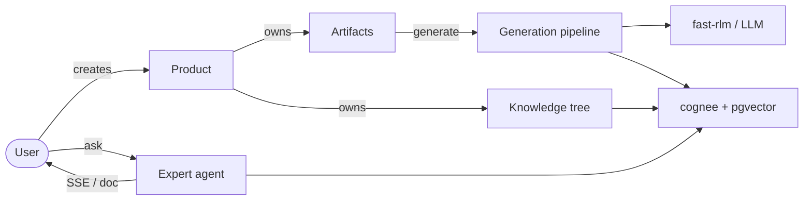
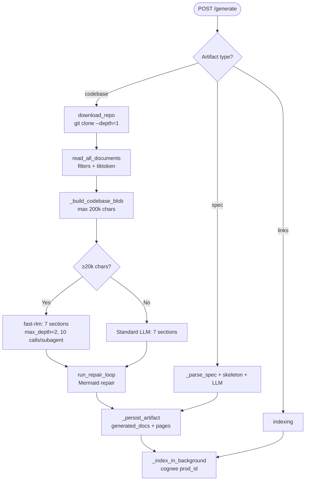

# Productarium

> A product-centric technical documentation platform with fully local LLM/RAG: no cloud API keys required.

Productarium turns repositories, specs, links, and knowledge pages into coherent, indexed, verifiable documentation. Each **Product** (a microservice, monolith, or data-bus service) owns **Artifacts** (a codebase, an OpenAPI/AsyncAPI spec, links) and a tree of **Knowledge Nodes**. Document generation runs through local models (Ollama or any OpenAI-compatible server), long content is handled by the recursive language model **fast-rlm**, and semantic search plus a knowledge graph are powered by **cognee** on top of PostgreSQL + pgvector. An expert agent streams chat and produces self-contained Markdown documents over a product's entire indexed knowledge base.

[English](./README.md) | [Русский](./README.ru.md)

---

## Table of Contents

1. [Architecture Overview](#1-architecture-overview)
2. [Requirements & Dependencies](#2-requirements--dependencies)
3. [Quick Start](#3-quick-start)
4. [Two-Process Architecture](#4-two-process-architecture)
5. [Product-Centric Data Model](#5-product-centric-data-model)
6. [Backend Modules (api/)](#6-backend-modules-api)
7. [Routers (api/routers/)](#7-routers-apirouters)
8. [Authentication (api/auth/)](#8-authentication-apiauth)
9. [Integrations (api/integrations/)](#9-integrations-apiintegrations)
10. [Configuration (api/config/)](#10-configuration-apiconfig)
11. [Prompts (refs/prompts/)](#11-prompts-refsprompts)
12. [Documentation Generation Pipeline](#12-documentation-generation-pipeline)
13. [RAG & Knowledge Graph (cognee)](#13-rag--knowledge-graph-cognee)
14. [Recursive Language Models (RLM)](#14-recursive-language-models-rlm)
15. [Expert Agent](#15-expert-agent)
16. [Data Validation](#16-data-validation)
17. [Frontend (src/)](#17-frontend-src)
18. [Docker & Deployment](#18-docker--deployment)
19. [Environment Variables](#19-environment-variables)
20. [Testing](#20-testing)
21. [Key Patterns](#21-key-patterns)
22. [Troubleshooting](#22-troubleshooting)
23. [License & Third-Party Components](#23-license--third-party-components)

---

## 1. Architecture Overview

Productarium is a fully local, product-oriented documentation platform. The core framework is **adalflow** (RAG pipeline + FAISS), the knowledge graph is built on **cognee** (Postgres + pgvector), and long context is handled by **fast-rlm** (Recursive Language Models on Deno + Pyodide).

Data flow: **Product → Artifact → Documentation**.

- The user creates a **Product** (`POST /api/products`) and adds an **Artifact** (`POST /api/products/{id}/artifacts`).
- Generation (`POST /api/products/{id}/artifacts/{id}/generate`):
  - **codebase**: the backend clones the repository (shallow, `--depth=1`) into `~/.adalflow/repos/`, reads files, builds a long-context blob → **RLM** (if ≥20k chars) or a standard LLM generates 7 wiki sections from `refs/prompts/*.md` → `generated_docs` + `pages` are persisted → the repo is indexed into **cognee** (in the background).
  - **spec**: the spec is parsed (stdlib json/yaml) → a Markdown skeleton + LLM enrichment → indexed into cognee.
  - **links**: indexed directly.
- The frontend renders `artifact.pages` (nav tree) + Markdown/Mermaid; the Ask panel uses RAG (FAISS, top_k=20) augmented with cognee recall.
- The **Expert agent** (`POST /api/products/{id}/ask`) streams an SSE chat over all indexed knowledge (artifacts + knowledge nodes); `POST /api/products/{id}/ask/doc` generates a self-contained Markdown document.



---

## 2. Requirements & Dependencies

### Prerequisites
- **Python 3.11+**
- **Node.js** with **bun** (the frontend uses bun, not yarn)
- **Ollama** running locally with a generation model and an embedding model:
  ```bash
  ollama pull qwen3:8b           # or qwen3.5:9b, gemma3:12b, etc.
  ollama pull nomic-embed-text   # required for embeddings
  ```
- **PostgreSQL + pgvector** for product/artifact persistence and the cognee knowledge graph. `docker-compose up postgres` starts `pgvector/pgvector:pg18-trixie` (user/db: `cognee`/`cognee_db`). If Postgres is unreachable, `init_db()`/`init_cognee()` log a warning and fall back (the app still starts).

### Backend (Python FastAPI) — api/pyproject.toml
| Package | Purpose |
|---------|---------|
| `fastapi`, `uvicorn` | Web framework and ASGI server |
| `pydantic` | Request/response validation schemas |
| `adalflow` (≥0.1.0) | RAG pipeline + model handling |
| `faiss-cpu` | Vector search (FAISS indexes) |
| `tiktoken` | Token counting when reading repos |
| `openai` | OpenAI-compatible client for local servers |
| `ollama` | Ollama integration |
| `cognee` (postgres-binary) | Knowledge graph (Postgres + pgvector) |
| `fast-rlm` | Recursive Language Models (Deno + Pyodide) |
| `sqlalchemy` (≥2.0) | ORM, product/artifact persistence |
| `psycopg` | PostgreSQL driver |
| `authlib` | OIDC (Keycloak) |
| `passlib[bcrypt]` | Password hashing (local auth) |
| `pyjwt` | Session JWTs |
| `cryptography` | Fernet encryption of settings-store secrets |
| `python-multipart` | File uploads (markitdown) |
| `markitdown` | Convert uploaded files to Markdown |
| `websockets` | WebSocket chat (`/ws/chat`) |
| `jinja2`, `pyyaml` | Prompt templates, YAML spec parsing |

### Frontend — package.json
`next` (15.3.1), `react` (19), `mermaid`, `next-intl`, `next-themes`, `@phosphor-icons/react`, `geist`, `react-markdown`, `react-syntax-highlighter`, `rehype-raw`, `remark-gfm`, `svg-pan-zoom`. Built with **bun**.

---

## 3. Quick Start

### Run with Docker Compose
```bash
cp .env.example .env
docker-compose up
```
This starts **postgres** (pgvector) and **deepwiki** (FastAPI on `:8001`, Next.js on `:3000`). Open [http://localhost:3000](http://localhost:3000). On first run, the UI walks you through creating the first admin user (`AUTH_PROVIDER=local`). Ollama is expected to run on the host; the compose file maps `host.docker.internal` to the host gateway.

### Backend (development)
```bash
python -m pip install poetry==2.0.1 && poetry install -C api
python -m api.main              # uvicorn on port 8001 (hot-reload in dev)
```

### Frontend
```bash
bun install
bun run dev        # port 3000, turbopack
bun run build      # production build
bun run lint       # ESLint (next/core-web-vitals + next/typescript)
```

### Postgres only
```bash
docker-compose up postgres
```

---

## 4. Two-Process Architecture

- **Frontend**: Next.js on port 3000. Proxies API calls to the backend via rewrites in `next.config.ts`.
- **Backend**: FastAPI on port 8001 (`api/api.py` is the main app, started via `api/main.py`).
- Communication: REST (SSE streaming) + WebSocket (`/ws/chat`).

```
┌─────────────────┐     ┌─────────────────┐     ┌─────────────────┐
│   Frontend      │     │   Backend       │     │   Ollama /      │
│   (Next.js 15)  │◄───►│   (FastAPI)     │◄───►│   Local LLM     │
│   Port: 3000    │     │   Port: 8001    │     │   Port: 11434   │
└─────────────────┘     └────────┬────────┘     └─────────────────┘
                                 │
                        ┌────────▼────────┐
                        │   Postgres +    │
                        │   pgvector      │
                        │   (cognee +     │
                        │    products)    │
                        └─────────────────┘
```

Proxy pattern: the frontend does NOT call the backend directly from the browser for most endpoints. `next.config.ts` defines rewrites that proxy `/api/products`, `/api/products/:path*`, `/api/rlm/run`, `/api/auth/*`, `/api/admin/*`, and `/api/lang/config` to `SERVER_BASE_URL` (default `http://localhost:8001`). WebSocket connections go directly to the backend.

---

## 5. Product-Centric Data Model

SQLAlchemy 2.0 ORM models in `api/models.py`. Shared Postgres+pgvector DB, shared with cognee. String PKs (`prod_…`/`art_…`/`user_…`/`node_…`/`tok_…`) keep frontend compatibility.

### ProductORM (table `products`)
`id, name, description, summary (AI-generated), owner_id (FK users.id), artifacts[], created_at, updated_at`.

### ArtifactORM (table `artifacts`)
`id, product_id (FK, cascade delete), name, type, kind, repo_url, repo_type, token, content, allure_url, generated_docs, pages (JSON), verified, verified_by, verified_at, source, created_at, updated_at`.
- `type` — enum: `codebase | spec | links | documentation | guides` (the last two are legacy).
- `kind` — subtype for spec: `openapi | asyncapi`.
- `LEGACY_ARTIFACT_TYPE_MAP` normalizes legacy types: `openapi → (spec, openapi)`, `asyncapi → (spec, asyncapi)`, `testcase → (documentation, testcase)`.

### KnowledgeNodeORM (table `knowledge_nodes`)
`id, product_id (FK), parent_id, title, slug, content_md, node_type (page|folder|branch), artifact_id, source, verified, verified_by, verified_at, created_by, created_at, updated_at`. Self-referential tree via `parent_id`, `ON DELETE CASCADE`.

### UserORM (table `productarium_users`)
`id, username, email, password_hash, role (admin|user), provider, must_change_password, created_at`.

### SettingORM (table `settings`)
`key, value` (Fernet-encrypted) — admin settings store.

### ApiTokenORM (table `api_tokens`)
`id, user_id (FK), name, token_hash (sha256), created_at, last_used_at`.

### db.py
`create_engine` with `pool_pre_ping`, `future=True`; `SessionLocal` + `get_db()` (FastAPI dependency); `init_db()` — `Base.metadata.create_all`, idempotent, non-fatal on error; `_run_one_shot_migration()` — additive `ALTER` statements + legacy type mapping.

---

## 6. Backend Modules (api/)

### `main.py` — entry point
Loads `.env`, calls `bootstrap_secret_key()`, `apply_ssl_env()`, `setup_logging()`, `watchfiles` monkey-patch (dev), `uvicorn.run` on `PORT` (default 8001), reload if `NODE_ENV != production`.

### `api.py` — main FastAPI app
REST endpoints (legacy wiki + Product/Artifact CRUD + generate + RLM run + expert agent), Pydantic models, wiki cache management, model config. `startup_event()` calls `init_db()` then `init_cognee()`. Includes all routers via `include_all_routers(app)`.

### `config.py` — central configuration
Loads JSON from `api/config/` with `${ENV_VAR}` placeholder replacement (`replace_env_placeholders`). Providers: `ollama` (`OllamaClient`), `openai_local` (`OpenAIClient`). Globals: `OLLAMA_HOST`, `LOCAL_OPENAI_BASE_URL`, `EMBEDDER_TYPE`. Functions: `get_model_config`, `get_embedder_config`, `is_ollama_embedder`, `get_embedder_type`, `fetch_ollama_models`, `fetch_openai_local_models`, `get_available_models`. `DEFAULT_EXCLUDED_DIRS/FILES` for repo reading. The `configs` dict aggregates generator/embedder/repo/lang.

### `cognee_manager.py` — cognee integration
Points cognee at **local Ollama** (LLM via `/v1`, embeddings via `/api/embed`, `LLM_API_KEY=not-needed`) so `cognify()` works with no cloud key. Model-name normalization for litellm (`_normalize_model_for_litellm` → `ollama/` or `openai/` prefix). Functions: `init_cognee()` (non-fatal), `apply_cognee_runtime_config()` (pushes admin models.cognee/embedder settings into cognee runtime singletons + clears the `create_embedding_engine` lru_cache), `add_and_index_document`, `query_cognee`, `_reconcile_stale_cognee_data`.

### `rlm_runner.py` — fast-rlm wrapper
fast-rlm (Deno + Pyodide, isolated REPL). `run_rlm_task_sync(query, model_name)` resolves the admin `models.docgen` config, applies `RLM_MODEL_BASE_URL/API_KEY/RLM_API_TIMEOUT_MS` (default 1800000ms), `config.max_depth=2`, `max_calls_per_subagent=10`. Coerces Ollama tags (`qwen3.5:35b-a3b`, `qwen3:8b`). `run_rlm_task` — async wrapper via `asyncio.to_thread`. `prewarm_rlm_background()` — daemon thread at boot.

### `settings_store.py` — encrypted store
Fernet-encrypted key/value over `SettingORM`. `bootstrap_secret_key()` persists the key to `~/.adalflow/.settings_secret_key`. Functions: `get_setting/set_setting/get_secret/delete_setting/list_settings`. Grouped getters: `get_model_for_task(task)` (docgen/expert/summary/cognee/embedder), `get_git_creds`, `get_confluence_creds`, `get_integration_config`. `get_rlm_mode(task)` returns `auto/rlm/llm` (forces `llm` if fast-rlm unavailable). `_sanitize_api_key` strips the `Bearer ` prefix and whitespace.

### `data_pipeline.py` — repository processing
- `download_repo` — `git clone --depth=1 --single-branch`, token auth for github/gitlab via URL injection.
- `read_all_documents` — reads code and docs (inclusion/exclusion filters), token counting via tiktoken, `MAX_EMBEDDING_TOKENS=8192`.
- `DatabaseManager` — `prepare_database` (paths under `~/.adalflow/repos` and `databases/*.pkl`), `prepare_db_index` (LocalDB + FAISS, embedding validation).
- `get_file_content` — fetch a file via the GitHub/GitLab API.

### `rag.py` — RAG over FAISS
Custom `Memory`/`CustomConversation`/`DialogTurn` classes (workaround for an adalflow list-index bug). `RAGAnswer` dataclass (`rationale`, `answer`). `RAG` class: `prepare_retriever`, `_validate_and_filter_embeddings` (consistent embedding sizes), `call()`. Uses `RAG_TEMPLATE` (Jinja) + `RAG_SYSTEM_PROMPT`.

### `wiki_generator.py` — wiki generator
`WikiGenerator` class; `SECTION_ORDER` (`overview, architecture, functional, technical, cicd, lld, datamodel`), `SECTION_NAMES` (Russian). `_format_prompt` uses `str.replace` (NOT `.format` — preserves Mermaid/JSON braces). `generate_all_sections` with `section_callback`. `create_wiki_section_context` builds `WikiSectionContext`. Prompt bodies are external — in `refs/prompts/*.md`.

### `artifact_docgen.py` — generation dispatcher
`generate_artifact_documentation()` routes by type:
- **codebase** → 7 sections via RLM/LLM.
- **spec + openapi/asyncapi** → stdlib render + LLM enrichment.
- **links** → indexing.
- **documentation (+testcase), guides** → LLM enrichment.

Tunables: `RLM_MIN_CHARS=20000`, `CODEBASE_BLOB_MAX_CHARS=200000`, `PER_FILE_MAX_CHARS=8000`, `RLM_SECTION_TIMEOUT=1200`, `RLM_MAX_FAILURES=1`. `_StandardLLM` wrapper. `_generate_section_text` (RLM→LLM fallback, shared `rlm_state`). `_build_codebase_blob`, `_build_file_analysis`, `_parse_spec`, `_render_openapi_skeleton/_render_asyncapi_skeleton`. Mermaid repair via `run_repair_loop`. `_index_in_background` into cognee dataset `prod_{product_id}`. `_persist_artifact` writes `generated_docs` + `pages`.

### `expert_agent.py` — expert agent
Product-scoped agent. `run_expert_chat` (stream/collect), `run_expert_doc`. `_ExpertLLM` (replicates `_StandardLLM` + async `stream()`). `_retrieve_product_knowledge` (cognee recall top_k=20 → fallback concatenate artifact docs). `_build_prompt` appends `conversation_history` + `product_knowledge` blocks. RLM routing (`_resolve_use_rlm`, `RLM_MIN_CHARS=20000`, `RLM_EXPERT_TIMEOUT=1200`). Loads `EXPERT_SYSTEM_PROMPT/EXPERT_DOC_PROMPT` from `refs/prompts`. `_chunk_text` for streamed fallback.

### `prompts.py` — prompt registry + loader
`WIKI_SECTIONS`, `get_section_title`, `LANGUAGE_INSTRUCTION`, `DETAIL_LEVEL_*`, `wrap_prompt`, `load_prompt_file`, `PROMPT_FILES` (filename→attr dict), `reload_prompt_file` (hot-reload via `importlib.reload` for `expert_agent`), `SECTION_PROMPTS` registry. `RAG_TEMPLATE` is inline.

### `schemas.py` — shared Pydantic schemas
`Product`, `Artifact`, `UserBase/Create/Out`, `LoginRequest`, `SetupStatus/Request`, `ChangePasswordRequest`, `ResetPasswordRequest`, `UserCreateAdmin/Result`, `KnowledgeNode(+Create/Update)`, `ApiTokenCreate/Out`, `SettingOut/Update`.

### Other modules
- `openai_client.py` — custom OpenAI-compatible client for local LLM servers (llama.cpp, vLLM, etc.).
- `ollama_patch.py` — Ollama integration, model-existence checks, document-processing patches.
- `tools/embedder.py` — `get_embedder()` factory creating `adal.Embedder` instances from provider config.

---

## 7. Routers (api/routers/)

Auto-discovered via `api/routers/__init__.py` (`include_all_routers`) + `api/auth/router.py`. To add a router: create `api/routers/<name>.py` with a module-level `router = APIRouter(...)` — it is auto-included.

### `routers/expert.py` (prefix `/api/products`)
- `POST /{id}/ask` — SSE expert chat stream.
- `POST /{id}/ask/doc` — Markdown file download.
Requires `get_current_user`.

### `routers/knowledge.py`
- `GET` — knowledge tree.
- `POST/GET/PUT/DELETE` — nodes.
- `POST upload` — file upload (via markitdown).
- `POST verify` — toggle verified (owner/admin).
- `POST summary` — `generate_product_summary` → writes `ProductORM.summary`.
Helpers: `build_tree`, `_validate_parent_move` (cycle check).

### `routers/public.py` (prefix `/api/public`, `require_api_token`)
- `GET knowledge` — export (markdown/json, verified-only).
- `POST ask` — expert SSE.
- `POST push` — publish to Confluence/git.

### `routers/admin.py` (prefix `/api/admin`, `require_admin`)
- `GET/PUT {group}` for `models/git/confluence/integrations/rlm/ssl` (secrets encrypted + redacted as `hasKey`).
- Users CRUD.
- API tokens create/delete (sha256, plaintext shown once).
- Prompts list/get/put (hot-reload).
- `{group}/test` — connectivity check (`_ping_model_endpoint` does an honest chat probe on 401/403).

### `routers/integrations.py`
- `GET /api/integrations` — list connectors.
- `POST {name}/test` (admin) — test.
- `GET {name}/spaces` — list spaces.
- `POST /api/products/{id}/artifacts/from-integration` — pull → artifact or node + cognee indexing.

---

## 8. Authentication (api/auth/)

`AUTH_PROVIDER` selects the mode: `local` (default) | `keycloak` | `both` | `none`.

### `deps.py`
- `get_current_user` — `productarium_session` cookie (JWT).
- `require_admin` — checks the admin role.
- `require_api_token` — Bearer token, sha256 hash, updates `last_used_at`.

### `local.py`
bcrypt `hash_password/verify_password`, `generate_reset_token/hash_token` (sha256), `RESET_TOKEN_TTL` 7 days.

### `tokens.py`
Issue/verify session JWTs (httpOnly cookie `productarium_session`). HS256, signed with `JWT_SECRET_KEY` (or `SETTINGS_SECRET_KEY`, or an ephemeral dev secret). Claims: `sub`, `username`, `role`, `iat`, `exp`. `SESSION_TOKEN_TTL` = 7 days.

### Other
- `bootstrap.py` — `bootstrap_admin` from `BOOTSTRAP_ADMIN_*`.
- `keycloak.py` — OIDC via authlib.
- `router.py` — auth endpoints (login/me/logout/setup/status, Keycloak login/callback).

---

## 9. Integrations (api/integrations/)

### `base.py` — `IntegrationConnector` (ABC)
`name`, `display_name`, `kind`, `requires_credentials`; methods `test()`, `list_spaces()`, `pull(source_id, opts)`; `get_config()`, `is_configured()`.

### `registry.py`
Auto-discovery via `pkgutil`, `register` decorator, functions `get_connector/get_connector_class/list_connectors/reset_registry`.

### Connectors
- `_git_base.py` — shared git base.
- `github.py` / `gitlab.py` — list repos, clone + document as `codebase` artifacts.
- `confluence.py` — list spaces, pull pages (recursively, attachments converted via markitdown) as `documentation` artifacts or knowledge nodes.
- `mcp.py` — Model Context Protocol: `http` transport (JSON-RPC `initialize` + `tools/call`) and `stdio` (documented stub).

Admins configure connectors (credentials encrypted in the settings store) and test connectivity from the admin panel. Pulled content is indexed into the cognee product dataset `prod_{product_id}` in the background.

---

## 10. Configuration (api/config/)

JSON files support `${ENV_VAR}` placeholders, resolved at load time by `replace_env_placeholders()` in `config.py`. Custom config directory via `DEEPWIKI_CONFIG_DIR`.

### `generator.json`
Two LLM providers: `ollama` (via adalflow `OllamaClient`, `default_model: qwen3.5:9b`) and `openai_local` (via the custom `OpenAIClient` for local servers: llama.cpp, vLLM, LM Studio, `default_model: qwen/qwen3.6-27b`). Both support custom models with `temperature`/`top_p` (for ollama — `num_ctx: 32000`).

### `embedder.json`
```json
{
  "embedder_ollama": { "client_class": "OllamaClient", "model_kwargs": { "model": "nomic-embed-text" } },
  "embedder_openai_local": { "batch_size": 100, "client_class": "OpenAIClient", "model_kwargs": { "model": "text-embedding-nomic-embed-text-v1.5" } },
  "retriever": { "top_k": 20 },
  "text_splitter": { "chunk_overlap": 100, "chunk_size": 350, "split_by": "word" }
}
```

### `repo.json`
File filters: `excluded_dirs` (`.venv`, `node_modules`, `.git`, etc.) and an extensive `excluded_files` list (lock files, binaries, build configs, minified files). `repository.max_size_mb: 50000`.

### `lang.json`
```json
{ "supported_languages": { "en": "English", "ru": "Русский (Russian)" }, "default": "ru" }
```

---

## 11. Prompts (refs/prompts/)

**All prompt bodies are externalized** to `refs/prompts/*.md` (~216 files: 7 wiki sections, spec/documentation/guides, expert agent, Deep Research iterations, RAG/simple-chat system prompts). Edit directly — no code changes. Loaded via `load_prompt_file()`.

Prompts are in Russian (designed for Qwen3.5-35b-a3b) with English technical terms. Prompt structure (using `overview.md` as an example):
- `<role>` — expert role for project analysis.
- `<context>` — placeholders: `{repo_url}`, `{repo_name}`, `{repo_type}`, `{primary_language}`, `{file_count}`, `{main_directories}`.
- `<requirements>` — 6 subsections: name/description, tech stack (table), key features, system requirements, project structure, status/license.
- `<style>` — Markdown formatting, Mermaid for visualization.
- `<important>` — analyze ALL files, concrete examples, no fabrication.

Substitution uses `str.replace` (NOT `.format`) so Mermaid/JSON braces stay unescaped.

---

## 12. Documentation Generation Pipeline

For detailed technical specification of the codebase documentation generation, cognee indexing, MCP integration, and UI polling pipeline, see [`docs/CODEBASE_DOCGEN_PIPELINE.md`](docs/CODEBASE_DOCGEN_PIPELINE.md).



7 sections are generated sequentially, each building on the previous ones (`create_wiki_section_context`):
1. **Overview** — name, stack, features, requirements, structure.
2. **Architecture**.
3. **Functional description**.
4. **Technical description**.
5. **CI/CD**.
6. **LLD** (Low-Level Design).
7. **Data Model**.

Generation is asynchronous: the backend returns `202 + job_id`, heavy work (git clone, file reading, RLM) runs in a worker thread. The frontend polls `/generate/status?job_id=` every 2 seconds (max ~15 minutes).

---

## 13. RAG & Knowledge Graph (cognee)

### RAG (api/rag.py)
- FAISS indexes in `~/.adalflow/databases/*.pkl`.
- Custom `Memory`/`CustomConversation`/`DialogTurn` — adalflow bug workaround.
- `RAGAnswer` dataclass (`rationale`, `answer`).
- `_validate_and_filter_embeddings` — drops inconsistent dimensions.
- `top_k=20`, `text_splitter`: chunk_size=350, overlap=100, split_by=word.

### cognee (api/cognee_manager.py)
- Knowledge graph Postgres + pgvector.
- cognee is pointed at **local Ollama** for LLM (`cognify` — entity extraction) and embeddings — no cloud key.
- cognee's validator requires the full groups `{LLM_MODEL, LLM_ENDPOINT, LLM_API_KEY}` and `{EMBEDDING_PROVIDER, EMBEDDING_MODEL, EMBEDDING_DIMENSIONS, HUGGINGFACE_TOKENIZER}` — `cognee_manager.py` sets them all via `setdefault`.
- `init_cognee()` is non-fatal (falls back to SQLite/LanceDB if Postgres is down).
- Product dataset: `prod_{product_id}`.
- `apply_cognee_runtime_config()` — pushes admin settings into cognee runtime singletons + clears the `create_embedding_engine` lru_cache.

---

## 14. Recursive Language Models (RLM)

`rlm_runner.py` wraps **fast-rlm** (Deno + Pyodide). The RLM REPL is isolated from host Python: the codebase is passed as a long-context string; host FastAPI/cognee are NOT reachable inside the REPL.

- **Used only for long context** (doc generation over large codebases, Deep Research).
- Simple chat/Ask use the standard adalflow `OllamaClient`.
- Falls back to the standard LLM if RLM is unavailable or the context is small (<20k chars).
- `run_rlm_task_sync(query, model_name)`: resolves the admin `models.docgen` config, `RLM_API_TIMEOUT_MS` (default 1800000ms = 30 min), `config.max_depth=2`, `max_calls_per_subagent=10`.
- Coerces Ollama tags: `qwen3.5:35b-a3b`, `qwen3:8b`.
- `prewarm_rlm_background()` — daemon thread at boot to speed up the first request.

---

## 15. Expert Agent

A product-scoped agent over all artifacts and knowledge nodes.

- `POST /api/products/{id}/ask` — SSE chat stream. Body: `{ query, messages, stream, use_rlm }`.
- `POST /api/products/{id}/ask/doc` — generate a self-contained Markdown document (.md download).

Internal flow:
1. `_retrieve_product_knowledge` — cognee recall (top_k=20) → fallback concatenate artifact docs.
2. `_build_prompt` — appends `conversation_history` + `product_knowledge` blocks.
3. RLM routing (`_resolve_use_rlm`): `RLM_MIN_CHARS=20000`, `RLM_EXPERT_TIMEOUT=1200`. The user can force: Auto / LLM / RLM (with LLM fallback).
4. `_ExpertLLM` streams the answer; `_chunk_text` for fallback streaming.

Prompts: `EXPERT_SYSTEM_PROMPT`, `EXPERT_DOC_PROMPT` in `refs/prompts/expert_agent_*.md`.

---

## 16. Data Validation

### Pydantic schemas (api/schemas.py)
All REST requests/responses are validated through Pydantic: `Product`, `Artifact`, `User*`, `LoginRequest`, `SetupStatus/Request`, `ChangePasswordRequest`, `ResetPasswordRequest`, `KnowledgeNode(+Create/Update)`, `ApiTokenCreate/Out`, `SettingOut/Update`.

### Embedding validation (rag.py)
`_validate_and_filter_embeddings` drops vectors of inconsistent dimensionality before building the FAISS index.

### Knowledge-tree validation (knowledge.py)
`_validate_parent_move` — cycle check when moving a node (a node cannot become its own descendant).

### Artifact-type validation (models.py)
`LEGACY_ARTIFACT_TYPE_MAP` + `_run_one_shot_migration()` normalize legacy types. The `ARTIFACT_TYPES` tuple constrains allowed types.

### Auth validation
- `get_current_user` — JWT verification, `exp` check.
- `require_admin` — checks `role == admin`.
- `require_api_token` — sha256 comparison, updates `last_used_at`.
- Local auth: bcrypt `verify_password`; reset tokens — sha256, TTL 7 days.

### Provider validation (admin.py)
`_ping_model_endpoint` makes an honest chat request to check connectivity (not just HTTP status), correctly handling 401/403.

### RLM context validation
`RLM_MIN_CHARS=20000` — RLM activation threshold; `CODEBASE_BLOB_MAX_CHARS=200000` — blob size limit; `PER_FILE_MAX_CHARS=8000` — per-file limit.

---

## 17. Frontend (src/)

**Visual language — minimalist-ui** (Notion/Linear editorial): warm monochrome palette (canvas `#FFFFFF`/`#F7F6F3`, 1px `#EAEAEA` borders), Geist font (self-hosted via `geist`) + system serif for headings, Phosphor icons, bento grids, no gradients/heavy shadows, quiet motion. Built with **bun**.

### `app/` structure
- `layout.tsx` — root layout, providers (Auth, Language, Notification, Theme).
- `page.tsx` — products dashboard: bento grid, inline create, delete, empty-state.
- `login/`, `reset-password/` — auth pages.
- `admin/` — admin panel (models, git, confluence, integrations, users, tokens, prompts, SSL).
- `products/[productId]/page.tsx` — product detail: header + type badge, artifacts bento, type-specific add-artifact form, per-artifact Generate, expert agent, knowledge tree.
- `products/[productId]/artifacts/[artifactId]/page.tsx` — artifact docs viewer: nav tree from `artifact.pages`, Markdown + Mermaid render, scoped Ask.
- `products/[productId]/knowledge/[nodeId]/page.tsx` — knowledge node view/edit.
- `api/` — Next.js route handlers (proxied to backend for auth, chat, models, wiki).

### Key `components/`
- `ui.tsx` — shared minimalist-ui primitives: `Card`, `Button` (primary/ghost/danger/subtle), `IconButton`, `Tag` (blue/green/yellow/red/neutral), `Input/Textarea/Select`, `Label`, `SectionHeader`, `Reveal` (IntersectionObserver, translateY+opacity, 600ms), `EmptyState`, `Spinner`, `TopBar`, `Banner` (info/success/error/warning), `Modal` (portal, ESC), `Switch`, `Avatar`, `Divider`, `Skeleton`.
- `Ask.tsx` — RAG chat interface. Deep Research toggle (multi-turn, up to 5 iterations).
- `ExpertChat.tsx` — expert agent: SSE stream from `POST /api/products/{id}/ask`, renders streamed Markdown (Mermaid via `<Markdown/>`), "Download as document" (`POST .../ask/doc`), Auto/LLM/RLM engine switcher. SSE tolerance: parses `data:` lines, accepts JSON with `{content|delta|text}`, falls back to raw text.
- `Mermaid.tsx` — Mermaid renderer with SVG pan/zoom and auto-fix.
- `Markdown.tsx` — Markdown renderer (react-markdown + rehype-raw + remark-gfm + syntax highlighting).
- `knowledge/KnowledgeTree.tsx` — knowledge tree (CRUD, drag, verify).
- `SummaryBlock.tsx` — AI product summary (`product.summary`).
- `SpecViewer.tsx`, `LinksViewer.tsx`, `MarkdownEditor.tsx`, `VerifiedBadge.tsx`, `AppHeader.tsx`, `Brand.tsx`, `UserMenu.tsx`, `LanguageToggle.tsx`, `AuthGuard.tsx`, `theme-toggle.tsx`, `notifications/*`.

### `lib/types.ts`
Shared TypeScript types mirroring the backend Pydantic schemas (`Product`, `Artifact`, `KnowledgeNode`, `User`, `ApiToken`, `SettingOut`). Helpers: `parseLinksContent`/`serializeLinksContent` (multi-format links parsing), `normalizePages` (3 `pages` shapes: dict/array/wrapper), `artifactToRepoInfo`, `slugify`, `buildKnowledgeTree`, `generateId`, `artifactTypeMeta`/`artifactTypeIcon`. Constants: `ARTIFACT_TYPE_META`, `LEGACY_ARTIFACT_TYPE_META`.

### `contexts/`
- `AuthContext.tsx` — auth state (cookie check, login/logout).
- `LanguageContext.tsx` — i18n via `next-intl`. Auto-detects browser language, loads from `src/messages/{lang}.json`.
- `NotificationContext.tsx` — toast notifications.

### Proxy pattern (next.config.ts)
Rewrites proxy `/api/products`, `/api/products/:path*`, `/api/rlm/run`, `/api/auth/*`, `/api/admin/*`, `/api/lang/config` to `SERVER_BASE_URL`. `output: "standalone"` for Docker, bundle optimization (`splitChunks`), `optimizePackageImports` for mermaid and react-syntax-highlighter.

---

## 18. Docker & Deployment

`docker-compose.yml`:
- **postgres** — `pgvector/pgvector:pg18-trixie` (user/db: `cognee`/`cognee_db`).
- **deepwiki** — built from `Dockerfile`, ports `PORT` + 3000, env for LM Studio/cognee/RLM/auth, `mem_limit: 6g`.
- **keycloak** + **kkdb** — (optional) OIDC provider.

Volumes: `postgres_data`, `~/.adalflow`, `./api/logs`, `deno_cache`.

The Dockerfile installs **bun** (frontend) and **Deno** (for fast-rlm) on top of Python. The frontend is built with `output: standalone`.

```bash
docker-compose up       # everything
docker-compose up postgres   # DB only
```

Local image build:
```bash
docker build -t productarium .
docker run -p 8001:8001 -p 3000:3000 \
  -e OLLAMA_HOST=http://host.docker.internal:11434 \
  -v ~/.adalflow:/root/.adalflow \
  productarium
```

Self-signed certificates: place `.crt`/`.pem` files in a `certs/` directory and run `docker build --build-arg CUSTOM_CERT_DIR=certs .`.

---

## 19. Environment Variables

**No cloud API keys are required.** Everything runs on local Ollama. See `.env.example`.

### Ollama
- `OLLAMA_HOST` (default `http://localhost:11434`).

### Local OpenAI-compatible API
- `LOCAL_OPENAI_BASE_URL` / `LOCAL_OPENAI_API_KEY` (fallback `not-needed`).

### Embedder
- `DEEPWIKI_EMBEDDER_TYPE` (`ollama` default).

### Postgres (products/artifacts + cognee)
- `DB_PROVIDER`, `DB_HOST` (default `localhost`; `postgres` in Docker), `DB_PORT`, `DB_NAME` (`cognee_db`), `DB_USERNAME`, `DB_PASSWORD`; `VECTOR_DB_PROVIDER=pgvector`.

### cognee LLM (local Ollama)
- `LLM_PROVIDER=ollama`, `LLM_ENDPOINT` (`/v1`), `LLM_MODEL`, `LLM_API_KEY=not-needed`.

### cognee embeddings
- `EMBEDDING_PROVIDER=ollama`, `EMBEDDING_MODEL=nomic-embed-text`, `EMBEDDING_ENDPOINT` (`/api/embed`), `EMBEDDING_DIMENSIONS=768`, `HUGGINGFACE_TOKENIZER=nomic-ai/nomic-embed-text-v1.5` (all required together by the cognee validator).

### fast-rlm
- `RLM_MODEL_BASE_URL` (default `http://localhost:11434/v1`), `RLM_MODEL_API_KEY=not-needed`, `RLM_MODEL_NAME` (default `qwen3:8b`), `RLM_API_TIMEOUT_MS` (default 1800000).

### Auth
- `AUTH_PROVIDER` (`local` | `keycloak` | `both` | `none`).
- `BOOTSTRAP_ADMIN_USERNAME`, `BOOTSTRAP_ADMIN_PASSWORD`.
- `SETTINGS_SECRET_KEY` (Fernet key for settings encryption + JWT signing).
- `JWT_SECRET_KEY` (optional, otherwise `SETTINGS_SECRET_KEY` is used).
- `SESSION_TOKEN_TTL` (default 7 days in seconds).

### Keycloak OIDC (when `AUTH_PROVIDER=keycloak|both`)
- `KEYCLOAK_URL` (default `http://localhost:8080`), `KEYCLOAK_CLIENT_ID` (default `productarium-frontend`), `KEYCLOAK_CLIENT_SECRET` (empty for public client), `KEYCLOAK_REALM` (default `productarium`).

### Application
- `PORT` (default 8001), `SERVER_BASE_URL`, `DEEPWIKI_CONFIG_DIR`, `NODE_ENV`.

### Enterprise Git (optional)
- `GITHUB_ENTERPRISE_URL`, `GITLAB_SELF_HOSTED_URL`.

### SSL / corporate CA (optional)
- `SSL_*` variables (handled by `apply_ssl_env()`).

### Logging
- `LOG_LEVEL` (default `INFO`), `LOG_FILE_PATH` (default `api/logs/application.log`).

### cognee access control
- `ENABLE_BACKEND_ACCESS_CONTROL` (default `false`).

---

## 20. Testing

Two separate test systems:

```bash
# Pytest (unified tests/ directory)
pytest                                  # runs all tests in tests/
pytest tests/unit/                       # unit tests only
pytest tests/integration/                # integration tests only
pytest tests/unit/test_extract_repo_name.py # single file

# Alternative via test runner script
python tests/run_tests.py               # all categories
python tests/run_tests.py --unit        # tests/unit/
python tests/run_tests.py --integration # tests/integration/
```

Pytest config is in `pytest.ini` (`testpaths=tests`, strict markers, short tracebacks).

Frontend:
```bash
bun run lint       # ESLint (next/core-web-vitals + next/typescript)
bun run build      # build check
```

---

## 21. Key Patterns

### JSON configuration with env placeholders
JSON files in `api/config/` support `${ENV_VAR}` placeholders, resolved at load time by `replace_env_placeholders()`. Custom directory via `DEEPWIKI_CONFIG_DIR`.

### Provider system
Two LLM providers in `generator.json`: `ollama` (via adalflow `OllamaClient`) and `openai_local` (via the custom `OpenAIClient`). Both support custom models. The embedder is controlled separately via `DEEPWIKI_EMBEDDER_TYPE`.

### Externalized prompts
All prompt bodies live in `refs/prompts/*.md`. Substitution uses `str.replace` (NOT `.format`) so Mermaid/JSON braces stay unescaped. Hot-reload via `reload_prompt_file()` (`importlib.reload`).

### Wiki pipeline
7 sections are generated sequentially, each building on the previous ones. Code only defines section order + variable mapping; prompt bodies are external.

### Isolated RLM
The fast-rlm REPL is isolated from host Python. The codebase is passed as a string. Used only for long context; falls back to LLM when unavailable or the context is small.

### Non-fatal initialization
`init_db()` and `init_cognee()` are idempotent and non-fatal: if Postgres is unavailable, they log a warning and fall back (SQLite/LanceDB), and the app starts.

### Secret encryption
Fernet encryption via `SETTINGS_SECRET_KEY` in `settings_store.py`. Secrets are masked on read (returns `hasKey: true`). `bootstrap_secret_key()` persists the key to `~/.adalflow/.settings_secret_key`.

### Auto-discovery of routers and integrations
- Routers: add `api/routers/<name>.py` with `router = APIRouter(...)` — auto-included via `include_all_routers`.
- Integrations: `pkgutil` auto-discovery in `api/integrations/`, `register` decorator. Add `api/integrations/<name>.py` subclassing `IntegrationConnector` — no core changes.

### Custom memory/conversation in RAG
Custom `Memory` and `CustomConversation` in `rag.py` replace adalflow's built-in conversation management to work around a list-index bug. Dialog history is rebuilt from request messages on each call.

---

## 22. Troubleshooting

- **"Cannot connect to Ollama"** — ensure Ollama is running (`ollama serve`) at `OLLAMA_HOST`.
- **"Model not found"** — `ollama pull qwen3:8b` (or your chosen model) and `ollama pull nomic-embed-text`.
- **Postgres warnings on startup** — non-fatal; the app falls back to SQLite/LanceDB for cognee. Run `docker-compose up postgres` for full functionality.
- **"Cannot connect to API server"** — ensure the backend is running on port 8001.
- **CORS errors** — run frontend and backend on the same machine, or check `next.config.ts` rewrites.

---

## 23. License & Third-Party Components

Productarium is licensed under the **MIT License** — see the [LICENSE](LICENSE) file for the full text. The MIT License is a permissive open-source license that permits unrestricted use, modification, distribution, sublicensing, and **commercial use**, provided the copyright and permission notice are preserved.

### Attribution

Productarium is a fork of the **deepwiki-open** project, created by **Sheing Ng** and originally distributed under the MIT License. We gratefully acknowledge the original work.

- **Original project:** [AsyncFuncAI/deepwiki-open](https://github.com/AsyncFuncAI/deepwiki-open)
- **Original author:** Sheing Ng
- **Original license:** MIT

Per the MIT License, the original copyright notice (© 2024 Sheing Ng) is preserved alongside the copyright for the Productarium modifications (© 2026 Ilya Bocharov) in the [LICENSE](LICENSE) file.

### Third-Party Licenses

All dependencies use licenses that permit commercial use. The vast majority are permissive (MIT, Apache-2.0, BSD); one dependency is weak copyleft (LGPL-3.0-only), which still permits commercial use but carries notice and relinking obligations.

**Permissive licenses (MIT/Apache-2.0/BSD):** adalflow (MIT), cognee (Apache-2.0), fast-rlm (MIT), markitdown (MIT), fastapi (MIT), uvicorn (BSD-3-Clause), pydantic (MIT), sqlalchemy (MIT), faiss-cpu (MIT), tiktoken (MIT), openai (Apache-2.0), cryptography (Apache-2.0 OR BSD-3-Clause), authlib (BSD-3-Clause), passlib (BSD-3-Clause), pyjwt (MIT), jinja2 (BSD-3-Clause), pyyaml (MIT), websockets (BSD-3-Clause), ollama (MIT). Frontend dependencies (next, react, mermaid, next-intl, @phosphor-icons/react, geist, react-markdown, remark-gfm) — all MIT; svg-pan-zoom — BSD-2-Clause.

**Weak copyleft (LGPL-3.0-only):** psycopg (psycopg 3 with the `[binary]` extra). Used as a separate, unmodified library linked at runtime. Under LGPL-3.0-only, you may use and distribute psycopg in connection with Productarium, including commercially, provided that the psycopg library itself remains under LGPL-3.0-only, its source is available, and recipients can relink Productarium against a modified/updated version of psycopg.

**No strong copyleft (GPL/AGPL):** no dependency of Productarium is distributed under a strong copyleft license (GPL-2.0, GPL-3.0, or AGPL). License identifiers follow the [SPDX License List](https://spdx.org/licenses/).

---

## Additional Documentation

- `PROMPT.md` — detailed technical specification (in Russian): architecture, modules, API endpoints.
- `refs/` — `LLD.md`, `DataModel.md`, `current.json` references + `refs/prompts/*.md`.
- `api/README.md` — backend-specific documentation.
- `AGENTS.md` — guide for AI agents working with the repository.
