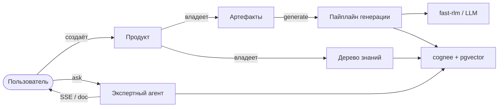
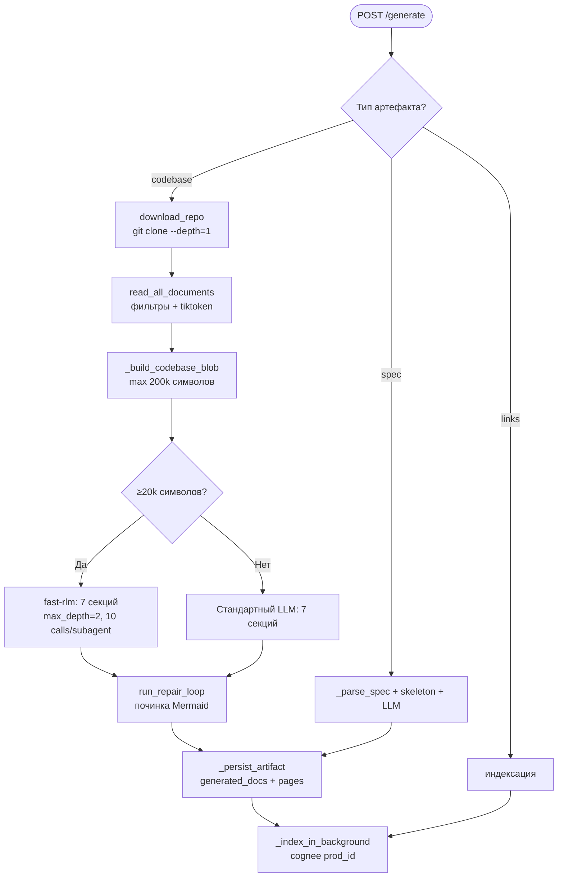

# Productarium

> Продукто-центричная платформа технической документации с полностью локальным LLM/RAG: ни одного облачного API-ключа не требуется.

Productarium превращает репозитории, спецификации, ссылки и страницы знаний в связную, индексированную, верифицируемую документацию. Каждый **Продукт** (микросервис, монолит или databus-сервис) владеет **Артефактами** (кодовая база, спецификация OpenAPI/AsyncAPI, ссылки) и деревом **Узлов знаний**. Генерация документов идёт через локальные модели (Ollama или любой OpenAI-совместимый сервер), длинный контент обрабатывается рекурсивной языковой моделью **fast-rlm**, а для семантического поиска и графа знаний используется **cognee** поверх PostgreSQL + pgvector. Экспертный агент ведёт потоковый чат и формирует самодостаточные Markdown-документы по всей индексированной базе знаний продукта.

[English](./README.md) | [Русский](./README.ru.md)

---

## Оглавление

1. [Краткое описание архитектуры](#1-краткое-описание-архитектуры)
2. [Требования и зависимости](#2-требования-и-зависимости)
3. [Быстрый старт](#3-быстрый-старт)
4. [Двухпроцессная архитектура](#4-двухпроцессная-архитектура)
5. [Продукто-центричная модель данных](#5-продукто-центричная-модель-данных)
6. [Бэкенд-модули (api/)](#6-бэкенд-модули-api)
7. [Роутеры (api/routers/)](#7-роутеры-apirouters)
8. [Аутентификация (api/auth/)](#8-аутентификация-apiauth)
9. [Интеграции (api/integrations/)](#9-интеграции-apiintegrations)
10. [Конфигурация (api/config/)](#10-конфигурация-apiconfig)
11. [Промпты (refs/prompts/)](#11-промпты-refsprompts)
12. [Пайплайн генерации документации](#12-пайплайн-генерации-документации)
13. [RAG и граф знаний (cognee)](#13-rag-и-граф-знаний-cognee)
14. [Рекурсивные языковые модели (RLM)](#14-рекурсивные-языковые-модели-rlm)
15. [Экспертный агент](#15-экспертный-агент)
16. [Валидация данных](#16-валидация-данных)
17. [Фронтенд (src/)](#17-фронтенд-src)
18. [Docker и развёртывание](#18-docker-и-развёртывание)
19. [Переменные окружения](#19-переменные-окружения)
20. [Тестирование](#20-тестирование)
21. [Ключевые паттерны](#21-ключевые-паттерны)
22. [Решение проблем](#22-решение-проблем)
23. [Лицензия и сторонние компоненты](#23-лицензия-и-сторонние-компоненты)

---

## 1. Краткое описание архитектуры

Productarium — полностью локальная, продуктово-ориентированная документационная платформа. Ядром служит фреймворк **adalflow** (RAG-пайплайн + FAISS), граф знаний построен на **cognee** (Postgres + pgvector), а длинный контекст обрабатывается **fast-rlm** (Recursive Language Models поверх Deno + Pyodide).

Поток данных: **Продукт → Артефакт → Документация**.

- Пользователь создаёт **Продукт** (`POST /api/products`) и добавляет **Артефакт** (`POST /api/products/{id}/artifacts`).
- Генерация (`POST /api/products/{id}/artifacts/{id}/generate`):
  - **codebase**: бэкенд клонирует репозиторий (shallow, `--depth=1`) в `~/.adalflow/repos/`, читает файлы, собирает длинный контекст → **RLM** (если ≥20k символов) или стандартный LLM генерирует 7 секций вики из `refs/prompts/*.md` → сохраняются `generated_docs` + `pages` → репозиторий индексируется в **cognee** (в фоне).
  - **spec**: спецификация парсится (stdlib json/yaml) → Markdown-скелет + LLM-обогащение → индексация в cognee.
  - **links**: индексируется напрямую.
- Фронтенд рендерит `artifact.pages` (дерево навигации) + Markdown/Mermaid; панель Ask использует RAG (FAISS, top_k=20) с дополнением cognee.
- **Экспертный агент** (`POST /api/products/{id}/ask`) ведёт потоковый SSE-чат по всем индексированным знаниям (артефакты + узлы знаний); `POST /api/products/{id}/ask/doc` генерирует самодостаточный Markdown-документ.



---

## 2. Требования и зависимости

### Предварительные требования
- **Python 3.11+**
- **Node.js** с **bun** (фронтенд использует bun, а не yarn)
- **Ollama** должна работать локально с моделью генерации и моделью эмбеддингов:
  ```bash
  ollama pull qwen3:8b           # или qwen3.5:9b, gemma3:12b и т.д.
  ollama pull nomic-embed-text   # обязательно для эмбеддингов
  ```
- **PostgreSQL + pgvector** для персистентности продуктов/артефактов и графа знаний cognee. `docker-compose up postgres` запускает `pgvector/pgvector:pg18-trixie` (user/db: `cognee`/`cognee_db`). Если Postgres недоступен, `init_db()`/`init_cognee()` логируют предупреждение и откатываются (приложение всё равно стартует).

### Бэкенд (Python FastAPI) — api/pyproject.toml
| Пакет | Назначение |
|-------|-----------|
| `fastapi`, `uvicorn` | Веб-фреймворк и ASGI-сервер |
| `pydantic` | Схемы валидации запросов/ответов |
| `adalflow` (≥0.1.0) | RAG-пайплайн + работа с моделями |
| `faiss-cpu` | Векторный поиск (FAISS-индексы) |
| `tiktoken` | Подсчёт токенов при чтении репозитория |
| `openai` | OpenAI-совместимый клиент для локальных серверов |
| `ollama` | Интеграция с Ollama |
| `cognee` (postgres-binary) | Граф знаний (Postgres + pgvector) |
| `fast-rlm` | Рекурсивные языковые модели (Deno + Pyodide) |
| `sqlalchemy` (≥2.0) | ORM, персистентность продуктов/артефактов |
| `psycopg` | Драйвер PostgreSQL |
| `authlib` | OIDC (Keycloak) |
| `passlib[bcrypt]` | Хэширование паролей (локальная аутентификация) |
| `pyjwt` | Сессионные JWT |
| `cryptography` | Fernet-шифрование секретов в settings store |
| `python-multipart` | Загрузка файлов (markitdown) |
| `markitdown` | Конвертация загруженных файлов в Markdown |
| `websockets` | WebSocket-чат (`/ws/chat`) |
| `jinja2`, `pyyaml` | Шаблоны промптов, парсинг YAML-спецификаций |

### Фронтенд — package.json
`next` (15.3.1), `react` (19), `mermaid`, `next-intl`, `next-themes`, `@phosphor-icons/react`, `geist`, `react-markdown`, `react-syntax-highlighter`, `rehype-raw`, `remark-gfm`, `svg-pan-zoom`. Сборка через **bun**.

---

## 3. Быстрый старт

### Запуск через Docker Compose
```bash
cp .env.example .env
docker-compose up
```
Поднимаются **postgres** (pgvector) и **deepwiki** (FastAPI `:8001`, Next.js `:3000`). Откройте [http://localhost:3000](http://localhost:3000). При первом запуске UI предложит создать администратора (`AUTH_PROVIDER=local`). Ollama ожидается на хосте; compose мапит `host.docker.internal` на шлюз хоста.

### Бэкенд (разработка)
```bash
python -m pip install poetry==2.0.1 && poetry install -C api
python -m api.main              # uvicorn на порту 8001 (hot-reload в dev)
```

### Фронтенд
```bash
bun install
bun run dev        # порт 3000, turbopack
bun run build      # production-сборка
bun run lint       # ESLint (next/core-web-vitals + next/typescript)
```

### Только Postgres
```bash
docker-compose up postgres
```

---

## 4. Двухпроцессная архитектура

- **Фронтенд**: Next.js на порту 3000. Проксирует API-вызовы к бэкенду через rewrites в `next.config.ts`.
- **Бэкенд**: FastAPI на порту 8001 (`api/api.py` — основное приложение, запускается через `api/main.py`).
- Коммуникация: REST (SSE-стриминг) + WebSocket (`/ws/chat`).

```
┌─────────────────┐     ┌─────────────────┐     ┌─────────────────┐
│   Фронтенд      │     │   Бэкенд        │     │   Ollama /      │
│   (Next.js 15)  │◄───►│   (FastAPI)     │◄───►│   Локальный LLM │
│   Порт: 3000    │     │   Порт: 8001    │     │   Порт: 11434   │
└─────────────────┘     └────────┬────────┘     └─────────────────┘
                                 │
                        ┌────────▼────────┐
                        │   Postgres +    │
                        │   pgvector      │
                        │   (cognee +     │
                        │    продукты)    │
                        └─────────────────┘
```

Прокси-паттерн: фронтенд НЕ вызывает бэкенд напрямую из браузера для большинства эндпоинтов. `next.config.ts` определяет rewrites, проксирующие `/api/products`, `/api/products/:path*`, `/api/rlm/run`, `/api/auth/*`, `/api/admin/*`, `/api/lang/config` к `SERVER_BASE_URL` (по умолчанию `http://localhost:8001`). WebSocket-соединения идут напрямую к бэкенду.

---

## 5. Продукто-центричная модель данных

Модели SQLAlchemy 2.0 ORM в `api/models.py`. Общая БД Postgres+pgvector, разделяемая с cognee. Строковые PK (`prod_…`/`art_…`/`user_…`/`node_…`/`tok_…`) сохраняют совместимость с фронтендом.

### ProductORM (таблица `products`)
`id, name, description, summary (AI-генерируемое), owner_id (FK users.id), artifacts[], created_at, updated_at`.

### ArtifactORM (таблица `artifacts`)
`id, product_id (FK, cascade delete), name, type, kind, repo_url, repo_type, token, content, allure_url, generated_docs, pages (JSON), verified, verified_by, verified_at, source, created_at, updated_at`.
- `type` — enum: `codebase | spec | links | documentation | guides` (последние два — legacy).
- `kind` — подтип для spec: `openapi | asyncapi`.
- `LEGACY_ARTIFACT_TYPE_MAP` нормализует старые типы: `openapi → (spec, openapi)`, `asyncapi → (spec, asyncapi)`, `testcase → (documentation, testcase)`.

### KnowledgeNodeORM (таблица `knowledge_nodes`)
`id, product_id (FK), parent_id, title, slug, content_md, node_type (page|folder|branch), artifact_id, source, verified, verified_by, verified_at, created_by, created_at, updated_at`. Самореференциальное дерево через `parent_id`, `ON DELETE CASCADE`.

### UserORM (таблица `productarium_users`)
`id, username, email, password_hash, role (admin|user), provider, must_change_password, created_at`.

### SettingORM (таблица `settings`)
`key, value` (зашифровано через Fernet) — хранилище настроек админ-панели.

### ApiTokenORM (таблица `api_tokens`)
`id, user_id (FK), name, token_hash (sha256), created_at, last_used_at`.

### db.py
`create_engine` с `pool_pre_ping`, `future=True`; `SessionLocal` + `get_db()` (FastAPI-зависимость); `init_db()` — `Base.metadata.create_all`, идемпотентно, неблокирующе при ошибке; `_run_one_shot_migration()` — аддитивные `ALTER` + маппинг legacy-типов.

---

## 6. Бэкенд-модули (api/)

### `main.py` — точка входа
Загружает `.env`, вызывает `bootstrap_secret_key()`, `apply_ssl_env()`, `setup_logging()`, monkey-patch `watchfiles` (dev), `uvicorn.run` на `PORT` (по умолчанию 8001), reload если `NODE_ENV != production`.

### `api.py` — основное FastAPI-приложение
REST-эндпоинты (legacy wiki + CRUD продуктов/артефактов + generate + RLM run + экспертный агент), Pydantic-модели, управление кэшем wiki, конфигурация моделей. `startup_event()` вызывает `init_db()` затем `init_cognee()`. Подключает все роутеры через `include_all_routers(app)`.

### `config.py` — центральная конфигурация
Загружает JSON из `api/config/` с заменой `${ENV_VAR}`-плейсхолдеров (`replace_env_placeholders`). Провайдеры: `ollama` (`OllamaClient`), `openai_local` (`OpenAIClient`). Глобалы: `OLLAMA_HOST`, `LOCAL_OPENAI_BASE_URL`, `EMBEDDER_TYPE`. Функции: `get_model_config`, `get_embedder_config`, `is_ollama_embedder`, `get_embedder_type`, `fetch_ollama_models`, `fetch_openai_local_models`, `get_available_models`. `DEFAULT_EXCLUDED_DIRS/FILES` для чтения репозитория. Словарь `configs` агрегирует generator/embedder/repo/lang.

### `cognee_manager.py` — интеграция cognee
Настраивает cognee на **локальный Ollama** (LLM через `/v1`, эмбеддинги через `/api/embed`, `LLM_API_KEY=not-needed`), чтобы `cognify()` работал без облачного ключа. Нормализация имён моделей для litellm (`_normalize_model_for_litellm` → префикс `ollama/` или `openai/`). Функции: `init_cognee()` (неблокирующая), `apply_cognee_runtime_config()` (проталкивает админ-настройки models.cognee/embedder в runtime-синглтоны cognee + чистит `create_embedding_engine` lru_cache), `add_and_index_document`, `query_cognee`, `_reconcile_stale_cognee_data`.

### `rlm_runner.py` — обёртка fast-rlm
fast-rlm (Deno + Pyodide, изолированный REPL). `run_rlm_task_sync(query, model_name)` резолвит админ-конфиг `models.docgen`, применяет `RLM_MODEL_BASE_URL/API_KEY/RLM_API_TIMEOUT_MS` (по умолчанию 1800000мс), `config.max_depth=2`, `max_calls_per_subagent=10`. Коэрсит теги Ollama (`qwen3.5:35b-a3b`, `qwen3:8b`). `run_rlm_task` — асинхронная обёртка через `asyncio.to_thread`. `prewarm_rlm_background()` — daemon-поток при загрузке.

### `settings_store.py` — зашифрованное хранилище
Fernet-шифрование key/value поверх `SettingORM`. `bootstrap_secret_key()` персистит ключ в `~/.adalflow/.settings_secret_key`. Функции: `get_setting/set_setting/get_secret/delete_setting/list_settings`. Групповые геттеры: `get_model_for_task(task)` (docgen/expert/summary/cognee/embedder), `get_git_creds`, `get_confluence_creds`, `get_integration_config`. `get_rlm_mode(task)` возвращает `auto/rlm/llm` (форсирует `llm` если fast-rlm недоступен). `_sanitize_api_key` удаляет префикс `Bearer ` и пробелы.

### `data_pipeline.py` — обработка репозитория
- `download_repo` — `git clone --depth=1 --single-branch`, токен-аутентификация для github/gitlab через инъекцию в URL.
- `read_all_documents` — чтение кода и доков (фильтры включения/исключения), подсчёт токенов через tiktoken, `MAX_EMBEDDING_TOKENS=8192`.
- `DatabaseManager` — `prepare_database` (пути в `~/.adalflow/repos` и `databases/*.pkl`), `prepare_db_index` (LocalDB + FAISS, валидация эмбеддингов).
- `get_file_content` — получение файла через GitHub/GitLab API.

### `rag.py` — RAG над FAISS
Кастомные классы `Memory`/`CustomConversation`/`DialogTurn` (обход бага adalflow с list-index). Dataclass `RAGAnswer` (`rationale`, `answer`). Класс `RAG`: `prepare_retriever`, `_validate_and_filter_embeddings` (консистентные размеры эмбеддингов), `call()`. Использует `RAG_TEMPLATE` (Jinja) + `RAG_SYSTEM_PROMPT`.

### `wiki_generator.py` — генератор вики
Класс `WikiGenerator`; `SECTION_ORDER` (`overview, architecture, functional, technical, cicd, lld, datamodel`), `SECTION_NAMES` (русские). `_format_prompt` использует `str.replace` (НЕ `.format` — сохраняет фигурные скобки Mermaid/JSON). `generate_all_sections` с `section_callback`. `create_wiki_section_context` строит `WikiSectionContext`. Тела промптов внешние — в `refs/prompts/*.md`.

### `artifact_docgen.py` — диспетчер генерации
`generate_artifact_documentation()` маршрутизирует по типу:
- **codebase** → 7 секций через RLM/LLM.
- **spec + openapi/asyncapi** → stdlib-рендер + LLM-обогащение.
- **links** → индексация.
- **documentation (+testcase), guides** → LLM-обогащение.

Настраиваемые параметры: `RLM_MIN_CHARS=20000`, `CODEBASE_BLOB_MAX_CHARS=200000`, `PER_FILE_MAX_CHARS=8000`, `RLM_SECTION_TIMEOUT=1200`, `RLM_MAX_FAILURES=1`. `_StandardLLM` — обёртка. `_generate_section_text` (RLM→LLM fallback, общий `rlm_state`). `_build_codebase_blob`, `_build_file_analysis`, `_parse_spec`, `_render_openapi_skeleton/_render_asyncapi_skeleton`. Ремонт Mermaid через `run_repair_loop`. `_index_in_background` в датасет cognee `prod_{product_id}`. `_persist_artifact` — запись `generated_docs` + `pages`.

### `expert_agent.py` — экспертный агент
Продукто-скоупный агент. `run_expert_chat` (stream/collect), `run_expert_doc`. `_ExpertLLM` (реплика `_StandardLLM` + async `stream()`). `_retrieve_product_knowledge` (cognee recall top_k=20 → fallback конкатенация доков артефактов). `_build_prompt` добавляет `conversation_history` + блоки `product_knowledge`. Маршрутизация RLM (`_resolve_use_rlm`, `RLM_MIN_CHARS=20000`, `RLM_EXPERT_TIMEOUT=1200`). Загружает `EXPERT_SYSTEM_PROMPT/EXPERT_DOC_PROMPT` из `refs/prompts`. `_chunk_text` для стримингового fallback.

### `prompts.py` — реестр + загрузчик промптов
`WIKI_SECTIONS`, `get_section_title`, `LANGUAGE_INSTRUCTION`, `DETAIL_LEVEL_*`, `wrap_prompt`, `load_prompt_file`, `PROMPT_FILES` (dict filename→attr), `reload_prompt_file` (hot-reload через `importlib.reload` для `expert_agent`), `SECTION_PROMPTS`-реестр. `RAG_TEMPLATE` — inline.

### `schemas.py` — общие Pydantic-схемы
`Product`, `Artifact`, `UserBase/Create/Out`, `LoginRequest`, `SetupStatus/Request`, `ChangePasswordRequest`, `ResetPasswordRequest`, `UserCreateAdmin/Result`, `KnowledgeNode(+Create/Update)`, `ApiTokenCreate/Out`, `SettingOut/Update`.

### Прочие модули
- `openai_client.py` — кастомный OpenAI-совместимый клиент для локальных LLM-серверов (llama.cpp, vLLM и т.д.).
- `ollama_patch.py` — интеграция Ollama, проверки существования моделей, патчи обработки документов.
- `tools/embedder.py` — фабрика `get_embedder()`, создающая `adal.Embedder` по конфигурации провайдера.

---

## 7. Роутеры (api/routers/)

Авто-обнаружение через `api/routers/__init__.py` (`include_all_routers`) + `api/auth/router.py`. Чтобы добавить роутер: создайте `api/routers/<name>.py` с module-level `router = APIRouter(...)` — он подключится автоматически.

### `routers/expert.py` (префикс `/api/products`)
- `POST /{id}/ask` — SSE-стрим чата эксперта.
- `POST /{id}/ask/doc` — скачивание Markdown-файла.
Требует `get_current_user`.

### `routers/knowledge.py`
- `GET` — дерево знаний.
- `POST/GET/PUT/DELETE` — узлы.
- `POST upload` — загрузка файлов (через markitdown).
- `POST verify` — переключение verified (owner/admin).
- `POST summary` — `generate_product_summary` → запись в `ProductORM.summary`.
Хелперы: `build_tree`, `_validate_parent_move` (проверка циклов).

### `routers/public.py` (префикс `/api/public`, `require_api_token`)
- `GET knowledge` — экспорт (markdown/json, только verified).
- `POST ask` — экспертный SSE.
- `POST push` — публикация в Confluence/git.

### `routers/admin.py` (префикс `/api/admin`, `require_admin`)
- `GET/PUT {group}` для `models/git/confluence/integrations/rlm/ssl` (секреты шифруются + маскируются как `hasKey`).
- Users CRUD.
- API-токены create/delete (sha256, plaintext показывается один раз).
- Промпты list/get/put (hot-reload).
- `{group}/test` — проверка связности (`_ping_model_endpoint` делает честный chat-проб на 401/403).

### `routers/integrations.py`
- `GET /api/integrations` — список коннекторов.
- `POST {name}/test` (admin) — проверка.
- `GET {name}/spaces` — список пространств.
- `POST /api/products/{id}/artifacts/from-integration` — pull → артефакт или узел + индексация в cognee.

---

## 8. Аутентификация (api/auth/)

`AUTH_PROVIDER` выбирает режим: `local` (по умолчанию) | `keycloak` | `both` | `none`.

### `deps.py`
- `get_current_user` — cookie `productarium_session` (JWT).
- `require_admin` — проверка роли admin.
- `require_api_token` — Bearer-токен, sha256-хэш, обновление `last_used_at`.

### `local.py`
bcrypt `hash_password/verify_password`, `generate_reset_token/hash_token` (sha256), `RESET_TOKEN_TTL` 7 дней.

### `tokens.py`
Issue/verify сессионных JWT (httpOnly cookie `productarium_session`). HS256, подпись `JWT_SECRET_KEY` (или `SETTINGS_SECRET_KEY`, или ephemeral dev-секрет). Claims: `sub`, `username`, `role`, `iat`, `exp`. `SESSION_TOKEN_TTL` = 7 дней.

### Прочее
- `bootstrap.py` — `bootstrap_admin` из `BOOTSTRAP_ADMIN_*`.
- `keycloak.py` — OIDC через authlib.
- `router.py` — auth-эндпоинты (login/me/logout/setup/status, Keycloak login/callback).

---

## 9. Интеграции (api/integrations/)

### `base.py` — `IntegrationConnector` (ABC)
`name`, `display_name`, `kind`, `requires_credentials`; методы `test()`, `list_spaces()`, `pull(source_id, opts)`; `get_config()`, `is_configured()`.

### `registry.py`
Авто-обнаружение через `pkgutil`, декоратор `register`, функции `get_connector/get_connector_class/list_connectors/reset_registry`.

### Коннекторы
- `_git_base.py` — общая база для git.
- `github.py` / `gitlab.py` — список репозиториев, clone + документирование как `codebase`-артефакты.
- `confluence.py` — список пространств, pull страниц (рекурсивно, вложения конвертируются через markitdown) как `documentation`-артефакты или узлы знаний.
- `mcp.py` — Model Context Protocol: transport `http` (JSON-RPC `initialize` + `tools/call`) и `stdio` (документированный стаб).

Админы настраивают коннекторы (учётные данные шифруются в settings store) и проверяют связность из админ-панели. Вытянутое содержимое индексируется в cognee-датасет продукта `prod_{product_id}` в фоне.

---

## 10. Конфигурация (api/config/)

JSON-файлы поддерживают `${ENV_VAR}`-плейсхолдеры, резолвятся при загрузке через `replace_env_placeholders()` в `config.py`. Кастомная директория конфигов через `DEEPWIKI_CONFIG_DIR`.

### `generator.json`
Два провайдера LLM: `ollama` (через adalflow `OllamaClient`, `default_model: qwen3.5:9b`) и `openai_local` (через кастомный `OpenAIClient` для локальных серверов: llama.cpp, vLLM, LM Studio, `default_model: qwen/qwen3.6-27b`). Оба поддерживают кастомные модели с `temperature`/`top_p` (для ollama — `num_ctx: 32000`).

### `embedder.json`
```json
{
  "embedder_ollama": { "client_class": "OllamaClient", "model_kwargs": { "model": "nomic-embed-text" } },
  "embedder_openai_local": { "batch_size": 100, "client_class": "OpenAIClient", "model_kwargs": { "model": "text-embedding-nomic-embed-text-v1.5" } },
  "retriever": { "top_k": 20 },
  "text_splitter": { "chunk_overlap": 100, "chunk_size": 350, "split_by": "word" }
}
```

### `repo.json`
Фильтры файлов: `excluded_dirs` (`.venv`, `node_modules`, `.git`, и т.д.) и обширный `excluded_files` (lock-файлы, бинарники, конфиги сборки, минифицированные файлы). `repository.max_size_mb: 50000`.

### `lang.json`
```json
{ "supported_languages": { "en": "English", "ru": "Русский (Russian)" }, "default": "ru" }
```

---

## 11. Промпты (refs/prompts/)

**Все тела промптов вынесены** в `refs/prompts/*.md` (~216 файлов: 7 секций вики, spec/documentation/guides, экспертный агент, итерации Deep Research, системные промпты RAG/simple-chat). Редактируются напрямую — без изменения кода. Загружаются через `load_prompt_file()`.

Промпты на русском (рассчитаны на Qwen3.5-35b-a3b) с английскими техническими терминами. Структура промпта (на примере `overview.md`):
- `<role>` — роль эксперта по анализу проектов.
- `<context>` — плейсхолдеры: `{repo_url}`, `{repo_name}`, `{repo_type}`, `{primary_language}`, `{file_count}`, `{main_directories}`.
- `<requirements>` — 6 подразделов: название/описание, техстек (таблица), ключевые возможности, требования к системе, структура проекта, статус/лицензия.
- `<style>` — Markdown-форматирование, Mermaid для визуализации.
- `<important>` — анализировать ВСЕ файлы, конкретные примеры, без выдумок.

Подстановка через `str.replace` (НЕ `.format`), чтобы фигурные скобки Mermaid/JSON оставались неэкранированными.

---

## 12. Пайплайн генерации документации



7 секций генерируются последовательно, каждая строится на основе предыдущих (`create_wiki_section_context`):
1. **Общая информация** (Overview) — название, стек, возможности, требования, структура.
2. **Архитектура** (Architecture).
3. **Функциональное описание** (Functional).
4. **Техническое описание** (Technical).
5. **CI/CD**.
6. **LLD** (Low-Level Design).
7. **Модель данных** (Data Model).

Генерация асинхронная: бэкенд отдаёт `202 + job_id`, тяжёлая работа (git clone, чтение файлов, RLM) выполняется в worker-потоке. Фронтенд опрашивает `/generate/status?job_id=` каждые 2 секунды (макс ~15 минут).

---

## 13. RAG и граф знаний (cognee)

### RAG (api/rag.py)
- FAISS-индексы в `~/.adalflow/databases/*.pkl`.
- Кастомные `Memory`/`CustomConversation`/`DialogTurn` — обход бага adalflow.
- `RAGAnswer` dataclass (`rationale`, `answer`).
- `_validate_and_filter_embeddings` — отбрасывает неконсистентные размеры.
- `top_k=20`, `text_splitter`: chunk_size=350, overlap=100, split_by=word.

### cognee (api/cognee_manager.py)
- Граф знаний Postgres + pgvector.
- cognee нацелена на **локальный Ollama** для LLM (`cognify` — извлечение сущностей) и эмбеддингов — без облачного ключа.
- Валидатор cognee требует полные группы `{LLM_MODEL, LLM_ENDPOINT, LLM_API_KEY}` и `{EMBEDDING_PROVIDER, EMBEDDING_MODEL, EMBEDDING_DIMENSIONS, HUGGINGFACE_TOKENIZER}` — `cognee_manager.py` выставляет их все через `setdefault`.
- `init_cognee()` неблокирующая (откат к SQLite/LanceDB если Postgres недоступен).
- Датасет продукта: `prod_{product_id}`.
- `apply_cognee_runtime_config()` — проталкивает админ-настройки в runtime-синглтоны cognee + чистит `create_embedding_engine` lru_cache.

---

## 14. Рекурсивные языковые модели (RLM)

`rlm_runner.py` оборачивает **fast-rlm** (Deno + Pyodide). REPL RLM изолирован от хост-Python: кодовая база передаётся как длинная контекстная строка; хост FastAPI/cognee НЕ доступны внутри REPL.

- **Используется только для длинного контекста** (генерация доков по большим кодовым базам, Deep Research).
- Простой чат/Ask используют стандартный `OllamaClient` adalflow.
- Откат к стандартному LLM если RLM недоступен или контекст мал (<20k символов).
- `run_rlm_task_sync(query, model_name)`: резолвит админ-конфиг `models.docgen`, `RLM_API_TIMEOUT_MS` (по умолчанию 1800000мс = 30 мин), `config.max_depth=2`, `max_calls_per_subagent=10`.
- Коэрсит теги Ollama: `qwen3.5:35b-a3b`, `qwen3:8b`.
- `prewarm_rlm_background()` — daemon-поток при загрузке для ускорения первого запроса.

---

## 15. Экспертный агент

Продукто-скоупный агент поверх всех артефактов и узлов знаний.

- `POST /api/products/{id}/ask` — SSE-стрим чата. Тело: `{ query, messages, stream, use_rlm }`.
- `POST /api/products/{id}/ask/doc` — генерация самодостаточного Markdown-документа (скачивание .md).

Внутренний поток:
1. `_retrieve_product_knowledge` — cognee recall (top_k=20) → fallback конкатенация доков артефактов.
2. `_build_prompt` — добавляет `conversation_history` + блоки `product_knowledge`.
3. Маршрутизация RLM (`_resolve_use_rlm`): `RLM_MIN_CHARS=20000`, `RLM_EXPERT_TIMEOUT=1200`. Пользователь может форсировать: Auto / LLM / RLM (с откатом к LLM).
4. `_ExpertLLM` стримит ответ; `_chunk_text` для fallback-стриминга.

Промпты: `EXPERT_SYSTEM_PROMPT`, `EXPERT_DOC_PROMPT` в `refs/prompts/expert_agent_*.md`.

---

## 16. Валидация данных

### Pydantic-схемы (api/schemas.py)
Все REST-запросы/ответы валидируются через Pydantic: `Product`, `Artifact`, `User*`, `LoginRequest`, `SetupStatus/Request`, `ChangePasswordRequest`, `ResetPasswordRequest`, `KnowledgeNode(+Create/Update)`, `ApiTokenCreate/Out`, `SettingOut/Update`.

### Валидация эмбеддингов (rag.py)
`_validate_and_filter_embeddings` отбрасывает векторы неконсистентной размерности перед построением FAISS-индекса.

### Валидация дерева знаний (knowledge.py)
`_validate_parent_move` — проверка на циклы при перемещении узла (нельзя сделать узел потомком самого себя).

### Валидация типов артефактов (models.py)
`LEGACY_ARTIFACT_TYPE_MAP` + `_run_one_shot_migration()` нормализуют legacy-типы. `ARTIFACT_TYPES`-кортеж ограничивает допустимые типы.

### Валидация аутентификации
- `get_current_user` — верификация JWT, проверка `exp`.
- `require_admin` — проверка `role == admin`.
- `require_api_token` — sha256-сравнение, обновление `last_used_at`.
- Локальная аутентификация: bcrypt `verify_password`; токены сброса — sha256, TTL 7 дней.

### Валидация провайдеров (admin.py)
`_ping_model_endpoint` делает честный chat-запрос для проверки связности (не только HTTP-статус), корректно обрабатывает 401/403.

### Валидация контекста RLM
`RLM_MIN_CHARS=20000` — порог включения RLM; `CODEBASE_BLOB_MAX_CHARS=200000` — ограничение размера blob; `PER_FILE_MAX_CHARS=8000` — лимит на файл.

---

## 17. Фронтенд (src/)

**Визуальный язык — minimalist-ui** (Notion/Linear editorial): тёплая монохромная палитра (canvas `#FFFFFF`/`#F7F6F3`, 1px `#EAEAEA`-границы), шрифт Geist (self-hosted через `geist`) + системный serif для заголовков, иконки Phosphor, bento-сетки, без градиентов/тяжёлых теней, тихая анимация. Сборка через **bun**.

### Структура `app/`
- `layout.tsx` — корневой layout, провайдеры (Auth, Language, Notification, Theme).
- `page.tsx` — дашборд продуктов: bento-сетка, инлайн-создание, удаление, empty-state.
- `login/`, `reset-password/` — страницы аутентификации.
- `admin/` — админ-панель (модели, git, confluence, интеграции, пользователи, токены, промпты, SSL).
- `products/[productId]/page.tsx` — детали продукта: хедер + бейдж типа, bento артефактов, форма добавления по типу, генерация per-artifact, экспертный агент, дерево знаний.
- `products/[productId]/artifacts/[artifactId]/page.tsx` — просмотр доков артефакта: дерево навигации из `artifact.pages`, рендер Markdown + Mermaid, scoped Ask.
- `products/[productId]/knowledge/[nodeId]/page.tsx` — просмотр/редактирование узла знаний.
- `api/` — Next.js route handlers (прокси к бэкенду для auth, chat, models, wiki).

### Ключевые компоненты `components/`
- `ui.tsx` — shared-примитивы minimalist-ui: `Card`, `Button` (primary/ghost/danger/subtle), `IconButton`, `Tag` (blue/green/yellow/red/neutral), `Input/Textarea/Select`, `Label`, `SectionHeader`, `Reveal` (IntersectionObserver, translateY+opacity, 600ms), `EmptyState`, `Spinner`, `TopBar`, `Banner` (info/success/error/warning), `Modal` (portal, ESC), `Switch`, `Avatar`, `Divider`, `Skeleton`.
- `Ask.tsx` — интерфейс чата с RAG. Deep Research toggle (мульти-турн, до 5 итераций).
- `ExpertChat.tsx` — экспертный агент: SSE-стрим из `POST /api/products/{id}/ask`, рендер streamed Markdown (Mermaid через `<Markdown/>`), «Download as document» (`POST .../ask/doc`), переключатель движка Auto/LLM/RLM. Толерантность к SSE: парсит `data:`-строки, принимает JSON с `{content|delta|text}`, fallback на raw-text.
- `Mermaid.tsx` — рендер Mermaid с SVG pan/zoom и авто-фиксом.
- `Markdown.tsx` — рендер Markdown (react-markdown + rehype-raw + remark-gfm + подсветка синтаксиса).
- `knowledge/KnowledgeTree.tsx` — дерево знаний (CRUD, drag, verify).
- `SummaryBlock.tsx` — AI-сводка продукта (`product.summary`).
- `SpecViewer.tsx`, `LinksViewer.tsx`, `MarkdownEditor.tsx`, `VerifiedBadge.tsx`, `AppHeader.tsx`, `Brand.tsx`, `UserMenu.tsx`, `LanguageToggle.tsx`, `AuthGuard.tsx`, `theme-toggle.tsx`, `notifications/*`.

### `lib/types.ts`
Shared TypeScript-типы, зеркалящие Pydantic-схемы бэкенда (`Product`, `Artifact`, `KnowledgeNode`, `User`, `ApiToken`, `SettingOut`). Хелперы: `parseLinksContent`/`serializeLinksContent` (мульти-форматный парсинг links), `normalizePages` (3 формы `pages`: dict/массив/wrapper), `artifactToRepoInfo`, `slugify`, `buildKnowledgeTree`, `generateId`, `artifactTypeMeta`/`artifactTypeIcon`. Константы: `ARTIFACT_TYPE_META`, `LEGACY_ARTIFACT_TYPE_META`.

### `contexts/`
- `AuthContext.tsx` — состояние аутентификации (проверка cookie, login/logout).
- `LanguageContext.tsx` — i18n через `next-intl`. Авто-детект языка браузера, загрузка из `src/messages/{lang}.json`.
- `NotificationContext.tsx` — toast-уведомления.

### Прокси-паттерн (next.config.ts)
Rewrites проксируют `/api/products`, `/api/products/:path*`, `/api/rlm/run`, `/api/auth/*`, `/api/admin/*`, `/api/lang/config` к `SERVER_BASE_URL`. `output: "standalone"` для Docker, оптимизация bundle (`splitChunks`), `optimizePackageImports` для mermaid и react-syntax-highlighter.

---

## 18. Docker и развёртывание

`docker-compose.yml`:
- **postgres** — `pgvector/pgvector:pg18-trixie` (user/db: `cognee`/`cognee_db`).
- **deepwiki** — сборка из `Dockerfile`, порты `PORT` + 3000, env для LM Studio/cognee/RLM/auth, `mem_limit: 6g`.
- **keycloak** + **kkdb** — (опц.) OIDC-провайдер.

Volumes: `postgres_data`, `~/.adalflow`, `./api/logs`, `deno_cache`.

Dockerfile устанавливает **bun** (фронтенд) и **Deno** (для fast-rlm) поверх Python. Фронтенд собирается с `output: standalone`.

```bash
docker-compose up       # всё сразу
docker-compose up postgres   # только БД
```

Локальная сборка образа:
```bash
docker build -t productarium .
docker run -p 8001:8001 -p 3000:3000 \
  -e OLLAMA_HOST=http://host.docker.internal:11434 \
  -v ~/.adalflow:/root/.adalflow \
  productarium
```

Самоподписанные сертификаты: поместите `.crt`/`.pem` файлы в директорию `certs/` и выполните `docker build --build-arg CUSTOM_CERT_DIR=certs .`.

---

## 19. Переменные окружения

**Облачные API-ключи НЕ требуются.** Всё работает на локальном Ollama. См. `.env.example`.

### Ollama
- `OLLAMA_HOST` (по умолчанию `http://localhost:11434`).

### Локальный OpenAI-совместимый API
- `LOCAL_OPENAI_BASE_URL` / `LOCAL_OPENAI_API_KEY` (fallback `not-needed`).

### Эмбеддер
- `DEEPWIKI_EMBEDDER_TYPE` (`ollama` по умолчанию).

### Postgres (продукты/артефакты + cognee)
- `DB_PROVIDER`, `DB_HOST` (по умолчанию `localhost`; `postgres` в Docker), `DB_PORT`, `DB_NAME` (`cognee_db`), `DB_USERNAME`, `DB_PASSWORD`; `VECTOR_DB_PROVIDER=pgvector`.

### cognee LLM (локальный Ollama)
- `LLM_PROVIDER=ollama`, `LLM_ENDPOINT` (`/v1`), `LLM_MODEL`, `LLM_API_KEY=not-needed`.

### cognee embeddings
- `EMBEDDING_PROVIDER=ollama`, `EMBEDDING_MODEL=nomic-embed-text`, `EMBEDDING_ENDPOINT` (`/api/embed`), `EMBEDDING_DIMENSIONS=768`, `HUGGINGFACE_TOKENIZER=nomic-ai/nomic-embed-text-v1.5` (все обязательны вместе по валидатору cognee).

### fast-rlm
- `RLM_MODEL_BASE_URL` (по умолчанию `http://localhost:11434/v1`), `RLM_MODEL_API_KEY=not-needed`, `RLM_MODEL_NAME` (по умолчанию `qwen3:8b`), `RLM_API_TIMEOUT_MS` (по умолчанию 1800000).

### Auth
- `AUTH_PROVIDER` (`local` | `keycloak` | `both` | `none`).
- `BOOTSTRAP_ADMIN_USERNAME`, `BOOTSTRAP_ADMIN_PASSWORD`.
- `SETTINGS_SECRET_KEY` (Fernet-ключ для шифрования настроек + подпись JWT).
- `JWT_SECRET_KEY` (опц., иначе берётся `SETTINGS_SECRET_KEY`).
- `SESSION_TOKEN_TTL` (по умолчанию 7 дней в секундах).

### Keycloak OIDC (когда `AUTH_PROVIDER=keycloak|both`)
- `KEYCLOAK_URL` (по умолчанию `http://localhost:8080`), `KEYCLOAK_CLIENT_ID` (по умолчанию `productarium-frontend`), `KEYCLOAK_CLIENT_SECRET` (пусто для public client), `KEYCLOAK_REALM` (по умолчанию `productarium`).

### Приложение
- `PORT` (по умолчанию 8001), `SERVER_BASE_URL`, `DEEPWIKI_CONFIG_DIR`, `NODE_ENV`.

### Корпоративный Git (опц.)
- `GITHUB_ENTERPRISE_URL`, `GITLAB_SELF_HOSTED_URL`.

### SSL / корпоративный CA (опц.)
- `SSL_*`-переменные (обрабатываются `apply_ssl_env()`).

### Логирование
- `LOG_LEVEL` (по умолчанию `INFO`), `LOG_FILE_PATH` (по умолчанию `api/logs/application.log`).

### Управление доступом cognee
- `ENABLE_BACKEND_ACCESS_CONTROL` (по умолчанию `false`).

---

## 20. Тестирование

Две отдельные тестовые системы:

```bash
# Pytest (единая директория tests/)
pytest                                  # все тесты в tests/
pytest tests/unit/                       # только unit-тесты
pytest tests/integration/                # только интеграционные тесты
pytest tests/unit/test_extract_repo_name.py # одиночный файл

# Альтернатива через раннер
python tests/run_tests.py               # все категории
python tests/run_tests.py --unit        # tests/unit/
python tests/run_tests.py --integration # tests/integration/
```

Конфиг Pytest находится в `pytest.ini` (`testpaths=tests`, strict markers, short tracebacks).
Конфиг pytest — в `pytest.ini` (`testpaths=test`, strict markers, короткие traceback).

Фронтенд:
```bash
bun run lint       # ESLint (next/core-web-vitals + next/typescript)
bun run build      # проверка сборки
```

---

## 21. Ключевые паттерны

### JSON-конфигурация с env-плейсхолдерами
JSON-файлы в `api/config/` поддерживают `${ENV_VAR}`-плейсхолдеры, резолвятся при загрузке через `replace_env_placeholders()`. Кастомная директория через `DEEPWIKI_CONFIG_DIR`.

### Система провайдеров
Два LLM-провайдера в `generator.json`: `ollama` (через adalflow `OllamaClient`) и `openai_local` (через кастомный `OpenAIClient`). Оба поддерживают кастомные модели. Эмбеддер отдельно через `DEEPWIKI_EMBEDDER_TYPE`.

### Внешние промпты
Все тела промптов вынесены в `refs/prompts/*.md`. Подстановка через `str.replace` (НЕ `.format`), чтобы Mermaid/JSON-скобки оставались неэкранированными. Hot-reload через `reload_prompt_file()` (`importlib.reload`).

### Пайплайн вики
7 секций генерируются последовательно, каждая строится на предыдущих. Код только определяет порядок секций + маппинг переменных; тела промптов внешние.

### Изолированный RLM
REPL fast-rlm изолирован от хост-Python. Кодовая база передаётся как строка. Используется только для длинного контекста; откат к LLM при недоступности или малом контексте.

### Неблокирующая инициализация
`init_db()` и `init_cognee()` идемпотентны и неблокирующи: при недоступности Postgres логируют предупреждение и откатываются (SQLite/LanceDB), приложение стартует.

### Шифрование секретов
Fernet-шифрование через `SETTINGS_SECRET_KEY` в `settings_store.py`. Секреты маскируются при чтении (возвращается `hasKey: true`). `bootstrap_secret_key()` персистит ключ в `~/.adalflow/.settings_secret_key`.

### Авто-обнаружение роутеров и интеграций
- Роутеры: добавьте `api/routers/<name>.py` с `router = APIRouter(...)` — подключится автоматически через `include_all_routers`.
- Интеграции: `pkgutil`-авто-обнаружение в `api/integrations/`, декоратор `register`. Добавьте `api/integrations/<name>.py` с наследованием `IntegrationConnector` — без изменений ядра.

### Кастомная память/диалог в RAG
Кастомные `Memory` и `CustomConversation` в `rag.py` заменяют встроенное управление диалогом adalflow для обхода бага с list-index. История пересоздаётся из сообщений запроса при каждом вызове.

---

## 22. Решение проблем

- **«Cannot connect to Ollama»** — убедитесь, что Ollama запущена (`ollama serve`) по адресу `OLLAMA_HOST`.
- **«Model not found»** — `ollama pull qwen3:8b` (или выбранную модель) и `ollama pull nomic-embed-text`.
- **Предупреждения Postgres при старте** — не критично; приложение откатывается на SQLite/LanceDB для cognee. Запустите `docker-compose up postgres` для полной функциональности.
- **«Cannot connect to API server»** — убедитесь, что бэкенд запущен на порту 8001.
- **Ошибки CORS** — запускайте фронтенд и бэкенд на одной машине либо проверьте rewrites в `next.config.ts`.

---

## 23. Лицензия и сторонние компоненты

Productarium распространяется под лицензией **MIT** — полный текст см. в файле [LICENSE](LICENSE). Лицензия MIT является пермиссивной open-source лицензией, которая разрешает без ограничений использование, изменение, распространение, сублицензирование и **коммерческое использование** при условии сохранения уведомления об авторских правах и разрешения.

### Авторство

Productarium — форк проекта **deepwiki-open**, созданного **Sheing Ng** и изначально распространявшегося под лицензией MIT. Мы с благодарностью признаём оригинальную работу.

- **Оригинальный проект:** [AsyncFuncAI/deepwiki-open](https://github.com/AsyncFuncAI/deepwiki-open)
- **Оригинальный автор:** Sheing Ng
- **Оригинальная лицензия:** MIT

Согласно лицензии MIT, оригинальное уведомление об авторских правах (© 2024 Sheing Ng) сохраняется вместе с уведомлением об авторских правах на модификации Productarium (© 2026 Бочаров Илья / Ilya Bocharov) в файле [LICENSE](LICENSE).

### Лицензии сторонних компонентов

Все зависимости используют лицензии, разрешающие коммерческое использование. Подавляющее большинство — пермиссивные (MIT, Apache-2.0, BSD); одна зависимость имеет слабый copyleft (LGPL-3.0-only), что также допускает коммерческое использование, но накладывает обязательства по уведомлению и возможности перелинковки.

**Пермиссивные лицензии (MIT/Apache-2.0/BSD):** adalflow (MIT), cognee (Apache-2.0), fast-rlm (MIT), markitdown (MIT), fastapi (MIT), uvicorn (BSD-3-Clause), pydantic (MIT), sqlalchemy (MIT), faiss-cpu (MIT), tiktoken (MIT), openai (Apache-2.0), cryptography (Apache-2.0 OR BSD-3-Clause), authlib (BSD-3-Clause), passlib (BSD-3-Clause), pyjwt (MIT), jinja2 (BSD-3-Clause), pyyaml (MIT), websockets (BSD-3-Clause), ollama (MIT). Фронтендные зависимости (next, react, mermaid, next-intl, @phosphor-icons/react, geist, react-markdown, remark-gfm) — все MIT; svg-pan-zoom — BSD-2-Clause.

**Слабый copyleft (LGPL-3.0-only):** psycopg (psycopg 3 с extra `[binary]`). Используется как отдельная, немодифицированная библиотека, линкуемая во время выполнения. Согласно LGPL-3.0-only, вы можете использовать и распространять psycopg совместно с Productarium, в том числе в коммерческих целях, при условии, что сама библиотека psycopg остаётся под LGPL-3.0-only, её исходный код доступен, и получатели могут перелинковать Productarium с модифицированной/обновлённой версией psycopg.

**Отсутствие строгого copyleft (GPL/AGPL):** ни одна зависимость Productarium не распространяется под строгой copyleft-лицензией (GPL-2.0, GPL-3.0 или AGPL). Идентификаторы лицензий соответствуют [списку SPDX](https://spdx.org/licenses/).

---

## Дополнительная документация

- `PROMPT.md` — детальное техническое задание (на русском): архитектура, модули, API-эндпоинты.
- `refs/` — `LLD.md`, `DataModel.md`, `current.json`-референсы + `refs/prompts/*.md`.
- `api/README.md` — бэкенд-специфичная документация.
- `AGENTS.md` — гайд для AI-агентов, работающих с репозиторием.
