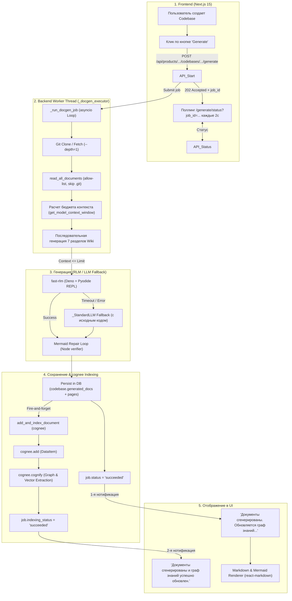

# Пайплайн добавления кодовой базы, генерации документации и показа в UI

Этот документ содержит подробное описание алгоритма добавления кодовой базы, асинхронной генерации 7 разделов документации (Wiki), индексации в Граф Знаний `cognee`, интеграции с MCP-сервером и отображения статусов пользователю в интерфейсе **Продуктариума**.

---

## 1. Архитектура и стек систем

* **Frontend**: Next.js 15 (Turbopack, Bun, React 19, TypeScript, Tailwind CSS, Phosphor Icons).
* **Backend API**: Python FastAPI (`uvicorn` на порту 8001, SQLAlchemy 2.0 ORM, Pydantic).
* **База данных**: PostgreSQL 18 + `pgvector` (базы `cognee_db`, таблицы `products`, `codebases`, `specs`, `links`, `knowledge_nodes`, `data`, `dataset_data`, `graph_node`, `graph_edge`).
* **LLM & Embeddings Gateway**: Локальный OpenAI-совместимый API (LM Studio / vLLM / llama.cpp) (модели: `qwen3.6-27b`, эмбеддинги: `nomic-embed-text-v2-moe`).
* **RLM Engine (`fast-rlm`)**: Движок рекурсивного рассуждения на базе Deno + Pyodide (изолированный REPL-интерпретатор Python), используемый для длинного контекста кодовых баз.
* **Knowledge Graph (`cognee` 1.2.2)**: Движок извлечения сущностей, связей и триплетов в Граф Знаний через `instructor` (Pydantic JSON schema mode).
* **MCP Server (`api/routers/mcp_server.py`)**: Нативный сервер Model Context Protocol (спецификация 2024-11-05, HTTP/SSE) для подключения внешних AI-агентов (Claude Desktop, Cursor, Windsurf).
* **Local MCP Client (`api/mcp_client.py`)**: Внутренний MCP-клиент для вызова инструментов локальных/удаленных MCP-серверов.

---

## 2. Схема работы алгоритма

---

## 3. Детальное описание этапов

### Шаг 1. Добавление кодовой базы
1. Пользователь в UI (`src/app/products/[productId]/page.tsx`) добавляет codebase, указывая:
   * `name`: Название сервиса.
   * `repo_url`: Ссылка на GitHub / GitLab репозиторий.
   * `repo_type`: `github` или `gitlab`.
   * `token`: Git-токен доступа (при необходимости).
2. Фронтенд отправляет `POST /api/products/{product_id}/codebases` в FastAPI backend.
3. В Postgres создаётся запись `CodebaseORM` (`id: art_...`, `product_id`, `repo_url`, `verified: false`).

### Шаг 2. Запуск асинхронной генерации (202 Accepted + Job Polling)
1. Пользователь нажимает кнопку **«Сгенерировать»** (`handleGenerate`).
2. Фронтенд отправляет запрос `POST /api/products/{product_id}/codebases/{codebase_id}/generate` с языком (`language: "ru"`).
3. Backend (`api/routers/docgen.py`):
   * Генерирует уникальный `job_id` (`uuid.uuid4().hex`).
   * Регистрирует задачу в глобальном реестре `_docgen_jobs[job_id]` с начальным состоянием:
     `status: "queued"`, `indexing_status: "idle"`, `indexing_message: "Генерация документации..."`.
   * Отправляет задачу в фоновый пул потоков `ThreadPoolExecutor` (`_docgen_executor`).
   * **Мгновенно возвращает ответ `202 Accepted`** с `{"job_id": "...", "status": "queued"}`. Это предотвращает обрыв длительного HTTP-соединения (предотвращает ошибки `ECONNRESET` в Next.js proxy).

### Шаг 3. Подготовка кодовой базы (Git Clone & Parsing)
Фоновый поток запускает `_run_docgen_job`, создаёт отдельный `asyncio` event loop и выполняет `generate_codebase_docs()` (`api/docgen/codebase.py`):

1. **Синхронизация репозитория (`api/data_pipeline.py`)**:
   * Вызывается `db_manager._create_repo(..., force_refresh=True)`.
   * Выполняется `git fetch --depth=1 origin` и `git reset --hard FETCH_HEAD` с очисткой временных файлов (`git clean -fdx`). Это гарантирует, что при повторной генерации читается **самый свежий коммит**.
2. **Чтение файлов (`read_all_documents`)**:
   * Обходится каталог репозитория (`~/.adalflow/repos/...`).
   * Игнорируются системные и бинарные папки (`.git`, `node_modules`, `dist`, `__pycache__`, `.venv` и др.).
   * Считываются только текстовые/исходные файлы (`.py`, `.ts`, `.go`, `.md`, `.json`, `.yaml` и т.д.).
3. **Формирование блоба кодовой базы (`_build_codebase_blob`)**:
   * Файлы форматируются в виде единого блоба с заголовками `### File: path/to/file.ext` и ограничением размера каждого файла (`PER_FILE_MAX_CHARS = 8000`).

### Шаг 4. Расчет бюджетов контекста и разбиение на чанки
Чтобы генерация гарантированно вписывалась в окно контекста модели и не вызывала ошибок `400 Context size has been exceeded` или `Prompt token budget exceeded`:

1. **Детектор окна контекста (`api/model_utils.py:get_model_context_window`)**:
   * Определяет размер окна контекста модели (`n_ctx`).
   * Очередность:
     1. Переменные окружения (`RLM_MODEL_CONTEXT_WINDOW`).
     2. Настройки задачи в базе/админке (`models.docgen.max_prompt_tokens`).
     3. Прямой запрос к API эндпоинта (`GET /v1/models` у OpenAI-compatible gateways) для чтения параметров `max_model_len` / `context_window`.
     4. Название модели (например, `32k` -> 32,768 токенов; `qwen3.6-27b` -> 32,768 токенов; `8b` -> 8,192 токена).
     5. Дефолт: 8,192 токена.
2. **Чанкование кодовой базы (`_resolve_codebase_chunk_budget`)**:
   * Из общего размера контекста (например, 32,768 токенов) вычитается резерв на генерацию ответа (`completion_reserve` = 4,096 токенов) -> `max_prompt_tokens = 28,672`.
   * Закладывается резерв **35–40%** (11,468 токенов) на накладные расходы субагентов RLM в Pyodide REPL.
   * Размер чанка кодовой базы получается равным **17,204 токенам**.
   * Если кодовая база превышает этот размер, `_chunk_file_blocks()` автоматически разбивает исходный код на несколько безопасных чанков для Map-Reduce.

### Шаг 5. Последовательная генерация 7 разделов Wiki
Специализированный генератор в `api/docgen/codebase.py` последовательно генерирует 7 классических разделов документации:
1. **Overview** (Обзор)
2. **Architecture** (Архитектура и Mermaid C4/компонентные диаграммы)
3. **Functional** (Функциональные возможности и API)
4. **Technical** (Технический стек и конфигурация)
5. **CI/CD** (Сборка, развертывание, Docker)
6. **LLD** (Низкоуровневый дизайн и модули)
7. **Data Model** (Модель данных и схемы)

Для каждого раздела:
* Шаблон промпта загружается из файла `refs/prompts/<section>.md`.
* Подставляются контекстные переменные (`{repo_name}`, `{file_tree}`, `{tech_stack}`, `{previous_content}` от предыдущих разделов).
* Применяется единый гарды-валидатор `VERIFICATION_GUARD` (запрет выдумывания фактов, удаление префиксов номеров строк).

**Двухуровневый генератор (RLM -> LLM Fallback)**:
* **Основной путь (RLM)**: Если кодовая база большая (>= 20k символов), вызывается `fast-rlm` (`api/rlm/runner.py`), выполняющий рекурсивный поиск фактов в коде.
* **Фоллбэк (Standard LLM)**: Если RLM сбоит, превышает таймаут или отключается прерывателем `RLM_MAX_FAILURES`, вызов переходит на стандартную локальную модель (`_StandardLLM`).
* **Гарантия наличия кода**: При фоллбэке исходный код чанка кодовой базы **всегда прикрепляется к промпту** и жестко обрезается функцией `cap(prompt, max_p_tokens)`. Это предотвращает генерацию пустых страниц или появление плашек `_(Раздел не сгенерирован)_`.
* **Mermaid Repair Loop (`api/mermaid_verifier.py`)**: Все сгенерированные Mermaid-диаграммы валидируются через парсер Node.js. Если в диаграмме есть синтаксическая ошибка, запускается автоисправление.

### Шаг 6. Сохранение результатов и начало индексации в cognee
По завершении генерации всех 7 разделов:
1. Результаты форматируются в итоговый Markdown и набор страниц `pages`.
2. Функция `_persist_artifact()` записывает `generated_docs` и `pages` в объект `CodebaseORM`.
3. Завершается транзакция БД `db.commit()`.
4. Статус задачи в реестре обновляется:
   * `job["status"] = "succeeded"`
   * `job["indexing_status"] = "indexing"`
   * `job["indexing_message"] = "Документы сгенерированы. Обновляется граф знаний (cognee)..."`
5. **Индексация в Граф Знаний cognee (`_index_in_background`)**:
   * В фоновом режиме запускается `add_and_index_document(repo_dir, dataset_name="prod_{product_id}")`.
   * В cognee отправляется подготовленный текстовый блог `DataItem(data=blob)`.
   * Вызывается `await cognee.add(ingest_payload, dataset_name=dataset_name)`.
   * Вызывается `await cognee.cognify(datasets=[dataset_name], chunk_size=safe_chunk_size)`.

### Шаг 7. Граф Знаний (cognee `cognify`) & Устранение сбоев
Во время `cognify()` cognee извлекает сущности и связи между ними:
1. **Предотвращение бесконечных рекурсий и спама**:
   * В `api/cognee/` пропатчен `OpenAIAdapter.acreate_structured_output` через `_ORIG_ACREATE_STRUCTURED_OUTPUT` (идемпотентно).
   * Вызовы `instructor` ограничены таймаутом `asyncio.wait_for(..., timeout=30.0)`.
   * Из условий повтора tenacity исключены `asyncio.CancelledError` и `BadRequestError`.
   * При таймауте отдельного чанка метод `_construct_dummy_model()` создаёт пустой объект Pydantic без вызова `ValidationError`, благодаря чему cognee продолжает обработку остальных чанков и **успешно завершает индексацию**.
2. По завершении индексации статус обновляется:
   * `job["indexing_status"] = "succeeded"`
   * `job["indexing_message"] = "Документы сгенерированы и граф знаний успешно обновлён."`

### Шаг 8. Поллинг и нотификации в UI
Фронтенд (`src/app/products/[productId]/page.tsx`) опрашивает статус эндпоинта `GET /api/products/{product_id}/codebases/{codebase_id}/generate/status?job_id=...`:

1. **Фаза 1 (Генерация)**: Пока `status === "running"`, отображается индикатор загрузки (Spinner).
2. **Фаза 2 (Переход к индексации)**:
   * Как только `st.status === "succeeded"` и `st.indexing_status === "indexing"`:
     * Фронтенд **однократно** выводит информационную нотификацию: `notify("Документы сгенерированы. Обновляется граф знаний (cognee)...")`.
     * Вызывается `fetchProduct()`, и сгенерированная документация **сразу становится доступной пользователю на экране**.
     * Поллинг продолжается каждые 2 секунды молча без повторного вызова нотификаций.
3. **Фаза 3 (Завершение индексации)**:
   * Когда `st.indexing_status === "succeeded"`:
     * Фронтенд выводит **второе финальное уведомление**: `notify("Документы сгенерированы и граф знаний успешно обновлён.")`.
     * Поллинг завершается, анимация загрузки отключается.

---

## 4. Использование сгенерированного знания

После завершения этого алгоритма Продуктариум становится **AI-native источником знаний по продукту**:

1. **Человеческий интерфейс (Notion/Linear style)**:
   * Пользователь просматривает страницы через навигационное дерево знаний, редактирует их в WYSIWYG-редакторе и помечает галочкой `verified` (верифицировано).
2. **Экспертный агент (Expert Agent SSE)**:
   * Встроенный чат `POST /api/products/{product_id}/ask` выполняет поиск гибридным RAG (`cognee` recall + FAISS) по набору знаний продукта и выдаёт точные ответы.
3. **Публичный REST API (`api/routers/public.py`)**:
   * Внешние системы с API-токеном запрашивают верифицированные знания продукта: `GET /api/public/products/{product_id}/knowledge` (в формате Markdown или JSON).
4. **Нативный MCP Server (`api/routers/mcp_server.py`)**:
   * Внешние AI-агенты (Claude Desktop, Cursor, Windsurf, авто-агенты) подключаются по протоколу MCP (`/api/mcp/sse`) и вызывают инструменты:
     * `list_products` — список доступных продуктов.
     * `get_product_knowledge` — выгрузка верифицированной документации продукта.
     * `search_product_graph` — прямые запросы к Графу Знаний cognee (`prod_{product_id}`) за фактами и связями.
     * `ask_expert` — обращение к экспертному агенту Продуктариума для решения задач доработки или разработки нового функционала.
