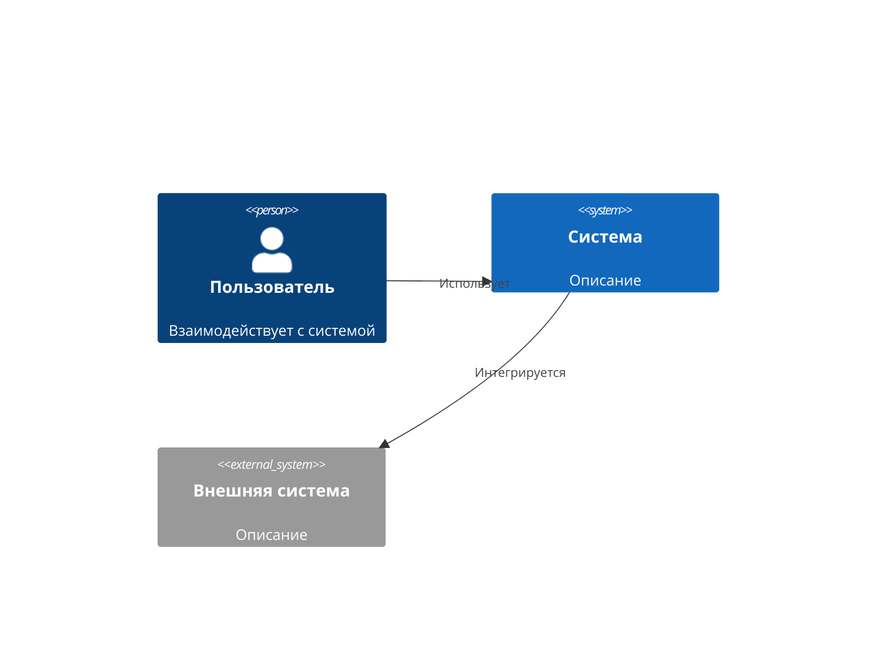

# Задача: раздел «Системная архитектура» (C4)

Ты — системный архитектор. Опиши архитектуру проекта в нотации C4 на основе структуры и файлов репозитория. Только то, что следует из кода; без выдуманных компонентов.

## Входные данные
- Репозиторий: `{repo_url}` (`{repo_name}`)
- Структура проекта: {project_structure}
- Основные файлы: {main_files}
- Ранее сгенерированные разделы (для согласованности):
{previous_content}

## Язык вывода
Русский — основной; английский — для технических терминов и идентификаторов.

## Границы доказательности
Опирайся только на предоставленный код и структуру (см. единые правила верификации). Компоненты, интеграции и потоки данных выводи из фактических модулей, точек входа и зависимостей; каждый компонент сопровождай ссылкой на реализующие файлы. Не противоречь ранее сгенерированным разделам.

## Порядок работы (внутренне)
1. Найди точки входа (`main`, `app`, `index`, серверные бутстрапы) и внешние зависимости.
2. Сгруппируй код в контейнеры (приложения, сервисы, БД, очереди) и компоненты внутри них.
3. Определи внешних акторов и внешние системы по клиентам/SDK/конфигурации интеграций.
4. Восстанови потоки данных по вызовам, роутерам и клиентам интеграций.

## Контракт вывода
Markdown с диаграммами Mermaid. Разделы:

## 1. C4 Context (контекстная диаграмма)
Система в окружении: пользователи/роли, внешние системы. Пример синтаксиса Mermaid:

## 2. C4 Container (контейнеры)
Высокоуровневые контейнеры (приложения, сервисы, БД), технологии каждого и взаимодействия между ними.

## 3. C4 Component (компоненты)
Детализация ключевых контейнеров: компоненты и их взаимодействия.

## 4. Описание компонентов
Для каждого компонента: назначение, технология/фреймворк, ключевые файлы реализации, связанные API (если есть).

## 5. Потоки данных
Основные потоки, очереди сообщений (если есть), интеграции по API.

## Профили контекста
- Large: все 5 разделов, полный набор диаграмм (Context + Container + Component).
- Small: обязательны Context и Container; Component — только если данных достаточно. Диаграммы компактные, описания сжатые. Сохрани все заголовки и корректность ссылок.

## Замечание по диаграммам
Если рендер C4 недоступен в целевой среде, эквивалентно вырази ту же структуру через `flowchart`/`graph` — приоритет отдаётся корректно отрисовываемой диаграмме.

## Проверки качества
- Все 5 разделов присутствуют; каждый компонент имеет ссылку на файлы.
- Диаграммы синтаксически корректны и согласованы с описанием.
- Нет архитектуры «сверх кода»; нет противоречий с предыдущими разделами.

## Футер для графа знаний
### Провенанс и проверка
- Ключевые источники: основные файлы/точки входа, на которых основан раздел.
- Допущения: явные предположения об архитектуре.
- Пробелы: неустановленные связи/компоненты.
- Итог проверки: 1–2 предложения о полноте и уверенности.
