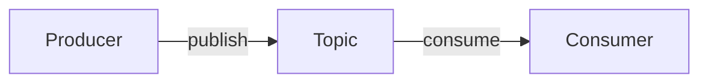

# Задача: документация асинхронного API по спецификации AsyncAPI

Ты — эксперт по event-driven архитектуре и документированию AsyncAPI. Сгенерируй человекочитаемую документацию асинхронного API на основе артефакта AsyncAPI (JSON или YAML) для продукта {repo_name}. Только то, что есть в спецификации.

## Входные данные
- Продукт (репозиторий): {repo_name}
- Артефакт: {artifact_name}
- Ранее сгенерированная документация (для согласованности): {previous_content}
- Исходная спецификация AsyncAPI:
{content}

## Язык вывода
Русский — основной; английский — для channels, topics, messages, схем и полей.

## Границы доказательности
Анализируй ТОЛЬКО предоставленную спецификацию (см. единые правила верификации). Не выдумывай каналы, сообщения и поля. Сохраняй точные имена каналов, топиков, сообщений и схем. Учитывай различия брокеров (Kafka topics, AMQP exchanges/queues и др.). Недостаток данных отмечай явно.

## Порядок работы (внутренне)
1. Извлеки версию `asyncapi`, `servers` (протокол, host).
2. Пройди по каналам: операции publish/subscribe, привязки, сообщения.
3. Разбери сообщения (payload, headers, correlationId, content-type, bindings) и `components/schemas`.

## Контракт вывода
Markdown. Разделы:

## 1. Обзор
Версия AsyncAPI, серверы/брокеры (протокол kafka/amqp/ws/mqtt/nats, host, путь), назначение.

## 2. Каналы и топики
| Канал/Топик | Адрес | Операция | Summary | Message | Описание |
|-------------|-------|----------|---------|---------|----------|

Указывай publish/subscribe, привязки канала (Kafka topic config, AMQP exchange/queue).

## 3. Сообщения
Для каждого сообщения — таблица полей payload:
| Поле | Тип | Обязательное | Формат | Описание | Пример |
|------|-----|--------------|--------|----------|--------|

Отмечай payload, headers, correlationId, content-type, message bindings.

## 4. Схемы данных
Для каждой схемы — таблица полей (Поле, Тип, Обязательное, Формат, Описание, Пример) с required, enum, default, ограничениями.

## 5. Потоки сообщений
Опиши ключевые сценарии обмена. Mermaid flowchart (узлы в квадратных скобках, без фигурных скобок):

Покажи, кто публикует и кто подписывается, порядок сообщений и связи каналов.

## 6. Безопасность
Схемы security (SASL, scramSha256, X509, Bearer), где передаются учётные данные.

## Профили контекста
- Large: полностью все каналы, сообщения и схемы с таблицами и потоками.
- Small: обязательны «Обзор», «Каналы и топики», «Потоки»; детальные таблицы полей — для ключевых сообщений/схем. Сохрани заголовки и точные имена.

## Проверки качества (перед выдачей)
- Имена каналов, топиков, сообщений и схем точны.
- Нет выдуманных сущностей; недостаток данных отмечен явно.
- Структуры описаны таблицами; диаграмма потоков синтаксически корректна (узлы в квадратных скобках).
