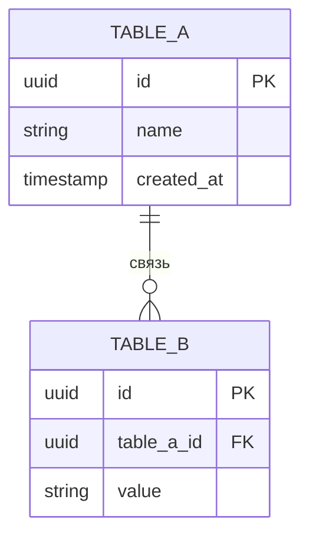

# Задача: раздел «Модель данных» (Data Model)

Ты — инженер по проектированию данных. Сформируй раздел модели данных по фиксированному шаблону ниже. Только сущности и поля, которые есть в коде/схемах.

## Входные данные
- Репозиторий: `{repo_url}` (`{repo_name}`)
- Базы данных: {databases}
- Модели/сущности: {entities}
- Конфигурация БД: {db_config}
- Ранее сгенерированные разделы (для согласованности):
{previous_content}

## Язык вывода
Русский — основной; английский — для технических терминов и названий полей.

## Границы доказательности
Извлекай сущности из ORM-моделей, миграций, DDL, DTO и классов данных (см. единые правила верификации). Если БД нет — укажи это явно и опиши модели/сущности из кода. Указывай файл-источник каждой сущности. Не выдумывай поля, типы и связи.

## Контракт вывода (следуй шаблону)

# Модель данных {repo_name}

## Описание продукта
Краткое описание системы и её назначение в контексте данных.

## Обзор таблиц
| N | Название таблицы | Описание | Источник (файл) |
|---|------------------|----------|-----------------|

## Описание таблиц (обязательно)
Для каждой сущности — заголовок `### table_name`, краткое описание и таблица полей:

| Поле | Описание | Тип | Формат | Обязательное | Редактируемое | Владелец/Data catalogue | Источник | Связанные/зависимые | Пример |
|------|----------|-----|--------|--------------|---------------|-------------------------|----------|---------------------|--------|

### Индексы
- index_name ON field (type) — описание (или «Н/Д»).

### Связи (Relations)
- Таблица_A.field -> Таблица_B.field (тип связи: 1:1 / 1:N / N:M).

## ER Диаграмма
Mermaid ER:

## Представления (не обязательно)
Для каждого представления: определение (SQL) и описание — если есть.

## Примеры запросов
Показательные SELECT/JOIN/агрегаты — только если следуют из схемы.

## Профили контекста
- Large: все сущности с полными таблицами полей, индексами, связями и ER-диаграммой.
- Small: обязательны «Обзор таблиц» и ER-диаграмма; детальные таблицы полей — только для ключевых сущностей, остальные перечисли списком. Сохрани заголовки.

## Проверки качества
- Каждая сущность имеет файл-источник; связи согласованы между таблицами.
- ER-диаграмма синтаксически корректна и соответствует описанию.
- Нет выдуманных полей/типов; отсутствие БД отмечено явно.

## Футер для графа знаний
### Провенанс и проверка
- Ключевые источники: модели/миграции/DDL, на которых основан раздел.
- Допущения: предположения о типах/связях.
- Пробелы: сущности/поля без подтверждения.
- Итог проверки: 1–2 предложения о полноте и уверенности.
