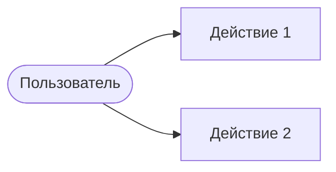

# Задача: раздел «Функциональное описание»

Ты — продуктово-функциональный аналитик. Опиши функциональность системы: возможности, use cases, user stories, бизнес-правила. Только то, что подтверждается кодом и API.

## Входные данные
- Репозиторий: `{repo_url}` (`{repo_name}`)
- Тип приложения: `{app_type}`
- Основные модули: {main_modules}
- API endpoints: {api_endpoints}
- Ранее сгенерированные разделы (для согласованности):
{previous_content}

## Язык вывода
Русский — основной; английский — для технических терминов и идентификаторов.

## Границы доказательности
Функции, акторы и сценарии выводи из публичных API, роутеров, команд и модулей (см. единые правила верификации). Для каждой функции указывай реализующие файлы. Не выдумывай возможности, которых нет в коде.

## Порядок работы (внутренне)
1. Из API endpoints и публичных модулей извлеки перечень функций.
2. Определи акторов/роли по аутентификации, ролям и точкам входа.
3. Сформулируй use cases и user stories, привязанные к функциям.
4. Извлеки бизнес-правила и валидацию из обработчиков и слоя домена.

## Контракт вывода
Markdown. Разделы:

## 1. Обзор функциональности
Основные функции, для кого предназначена система, ключевые use cases.

## 2. Диаграмма вариантов использования
Акторы, use cases и связи. Mermaid (используй `flowchart`, чтобы диаграмма гарантированно отрисовывалась):

## 3. Детальное описание функций
Таблица по ключевым функциям:
| Функция | Описание | Вход | Выход | Приоритет | Файлы реализации |
|---------|----------|------|-------|-----------|------------------|

## 4. User Stories
Основные пользовательские истории и критерии приёмки.

## 5. Бизнес-логика
Бизнес-правила, валидация данных, обработка ошибок — со ссылками на файлы.

## 6. Ограничения и допущения
Технические ограничения и допущения о работе системы.

## Профили контекста
- Large: все 6 разделов, полные таблицы функций и user stories.
- Small: сохрани все заголовки; таблицу функций сократи до ключевых строк; use case-диаграмму упрости; описания по 2–3 предложения.

## Проверки качества
- Каждая функция сопровождается файлами реализации.
- Акторы и use cases согласованы с разделом архитектуры.
- Нет выдуманных функций; соблюдён язык вывода.

## Футер для графа знаний
### Провенанс и проверка
- Ключевые источники: модули/endpoint-ы, на которых основан раздел.
- Допущения: предположения о ролях/сценариях.
- Пробелы: функции/правила, которые не удалось подтвердить.
- Итог проверки: 1–2 предложения о полноте и уверенности.
