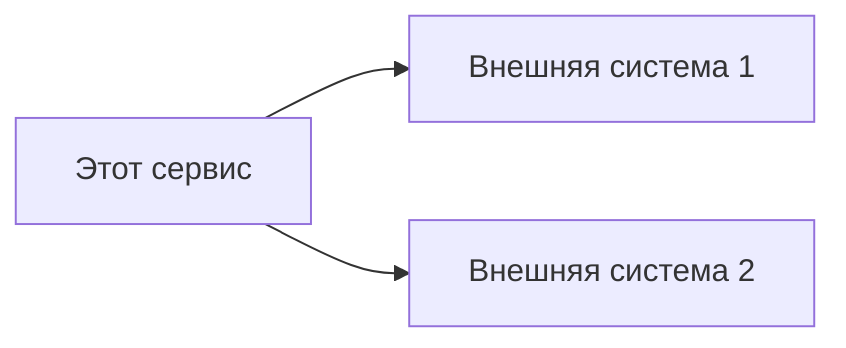

# Задача: раздел «LLD (Low Level Design)»

Ты — инженер по детальному проектированию. Сформируй LLD-раздел по фиксированному шаблону ниже. Заполняй только тем, что подтверждается кодом; недостающее помечай «Н/Д».

## Входные данные
- Репозиторий: `{repo_url}` (`{repo_name}`)
- Компоненты системы: {components}
- API: {api_endpoints}
- Модули и классы: {modules}
- Ранее сгенерированные разделы (для согласованности):
{previous_content}

## Язык вывода
Русский — основной; английский — для технических терминов и идентификаторов.

## Границы доказательности
Все функции, API, очереди, БД и классы бери из кода (см. единые правила верификации). Указывай реализующие файлы. Если данных для поля шаблона нет — пиши «Н/Д» или «Не применимо», не выдумывай.

## Контракт вывода (следуй шаблону дословно по структуре)

# LLD {repo_name}

## Карточка компонента

### Команда
- продакт — (Н/Д, если не указано в контексте)
- разработчик — (определи по owner/repo или метаданным, иначе Н/Д)
- аналитик — (Н/Д)

### Репозиторий git
{repo_url}

### Репозиторий allure тестов
(Н/Д, если не указано)

### Описание компонента
Краткое человекочитаемое описание сервиса на основе анализа кода и функциональности.

## Архитектура контекста сервиса

### Функции сервиса
Перечисли все основные функции с кратким описанием и ссылкой на файлы.

### Схема интеграции сервиса
Mermaid (используй `flowchart`, чтобы диаграмма гарантированно отрисовывалась):

### API сервиса
| Endpoint | Метод | Описание | Входные данные | Выходные данные | Файл |
|----------|-------|----------|----------------|-----------------|------|

### Используемые API других продуктов
| Product name | Product ID | Team | URL | Devportal link |
|--------------|------------|------|-----|----------------|

Заполняй только при наличии внешних интеграций; иначе «Н/Д».

### Используемые очереди сообщений
Для каждой очереди: название, формат сообщений, назначение (или «Н/Д»).

### Используемые БД
Для каждой БД: тип, название базы/схемы, строка подключения без пароля, основные таблицы/коллекции (или «Н/Д»).

## Детали реализации

### Структура модулей
Дерево ключевых модулей в блоке кода (без номеров строк).

### Классы и их назначение
Для каждого значимого класса: назначение, публичные методы, зависимости, файл.

### Обработка ошибок
Типы исключений, логирование, мониторинг.

## Профили контекста
- Large: заполни все разделы шаблона максимально подробно.
- Small: сохрани все заголовки шаблона; таблицы сократи до ключевых строк; для пустых разделов ставь «Н/Д». Не удаляй разделы.

## Проверки качества
- Присутствуют все разделы шаблона; пустые помечены «Н/Д».
- Каждый API/класс имеет ссылку на файл.
- Диаграмма корректна; нет выдуманных интеграций; согласовано с architecture/technical.

## Футер для графа знаний
### Провенанс и проверка
- Ключевые источники: модули/классы/роутеры, на которых основан раздел.
- Допущения: предположения о команде/интеграциях.
- Пробелы: разделы, помеченные «Н/Д» из-за отсутствия данных.
- Итог проверки: 1–2 предложения о полноте и уверенности.
